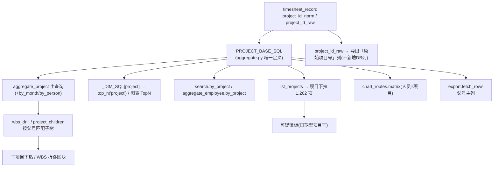
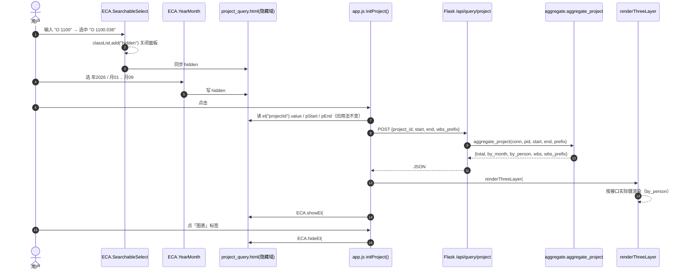

# ECAHelper 增量设计书 —— 第二轮迭代

> 文档类型：**增量设计书（Increment Design）** ｜ 版本：v2.0-inc
> 作者：架构师 Bob ｜ 关联文档：`docs/增量PRD-第二轮迭代.md`（v2.0-inc，产品经理 Alice）、`docs/设计书总览.md`、`docs/系统设计书.md`、`docs/附录A-源数据实测报告.md`
> 形态：本地离线 Web 应用（Python 3.13 + Flask 3.1 + Waitress 3 + SQLite + openpyxl 3.1.5 + 原生 JS / 原生 SVG）
> **硬约束**：完全离线、零 CDN、不引入任何新依赖（Python 侧仅 stdlib + 既有 Flask/waitress/openpyxl；前端仅原生 JS/CSS）、不引前端框架与构建链、不改现有 6 张表结构、不重新导入。

---

## 0. 阅读指引与本次交付边界

- 本设计书**只覆盖第二轮迭代的增量**，不回写第一轮 `docs/系统设计书.md`。
- 本轮**分两批独立交付、独立验收、独立提交**（对齐 PRD 决策 7）。本文档的「文件清单」「任务列表」均按批次标注。
- **唯一交付物 = 本文档**。本轮设计不修改任何代码、不改其他文档、不写脚本文件。
- 本文所有数字均**逐条引用** PRD/任务说明给出的实测值，**未自行重算**。

---

# Part A：系统设计

## 1. 实现方案概览

### 1.1 核心难点与应对

| 难点 | 本质 | 应对策略 |
|---|---|---|
| 缺陷 1：切标签致整页空白 | **CSS 类规则（`.hidden`）与内联 `style.display` 冲突**，且是**全站系统性**问题（不止一处） | 统一可见性工具 `showEl/hideEl/toggleEl`（一律走 `classList`），并在批次 1 做全站排查替换 |
| 任务字段 1,175 取值、精确相等匹配 | 取值爆炸 + 匹配语义错误 | 后端 `=`→`LIKE '%kw%'`（包含匹配）；前端可搜索下拉 + 全量候选 + 内存过滤 |
| 下拉候选量大（项目 1,262 / 任务 1,175…） | 原生 `<select>` 不可搜索、不可手输 | 自建**可搜索下拉**组件：全量载入、内存包含匹配、**只渲染前 50 条**、允许列表外值 |
| 日期控件难用 | 原生 `<input type="month">` 年份切换体验差 | 自建**年 + 月双下拉**组件，与既有隐藏域 `{p,e,s}Lo/Hi` 和快捷按钮协同 |
| 项目号父/子被拆开统计 | 口径需在**查询层**统一归并，且**不能改表结构/重导** | 单条 SQL 表达式 `PROJECT_BASE_SQL` 作为**唯一真源**，替换所有 `r.project_id_norm` 聚合位；保留 `project_id_raw` 作为原始号列 |
| 无日志系统 | 需文件日志 + 审计表 + 页面，且**仅本机、不得外传** | stdlib `logging` + `TimedRotatingFileHandler`；独立新表 `audit_log`；Flask `before/after_request` + `errorhandler` 挂钩 |

### 1.2 架构模式与分层（延续既有约定）

保持既有分层不变，仅做增量：

```
web/templates/*.html         ── 页面骨架（服务端 Jinja 渲染 + 少量取数）
web/static/js/               ── 原生 JS：components.js(新·组件库) / app.js(页面装配) / charts.js(可视)
        │  fetch()
web/…/routes/*.py            ── Flask 蓝图：HTTP 契约（7 个既有 + 新增 log_routes）
        │  调用
web/…/queries/aggregate.py   ── 聚合计引擎（唯一真源：EXCLUSION_SQL / PROJECT_BASE_SQL）
web/…/queries/export.py      ── 中英双语导出
web/…/services/*.py          ── person_service / quality_service / (新) audit_service
web/…/parsers/*.py           ── 导入管线（本轮不改）
        │
web/…/schema.sql             ── 建表（本轮仅**追加** audit_log）
config.py                    ── 路径/常量/映射（本轮追加 LOG_DIR、导出列、任务中文映射）
```

**依赖方向**：`routes → queries/services → db`；`templates ← routes`；前端 `app.js → components.js / charts.js`。**不引入新的反向依赖**。

### 1.3 分批次改动策略与边界

> 分批判据 = **风险隔离**：批次 1 全是前端与可见的交互/缺陷，**不触碰统计口径与数据库**，可快速交付拿反馈；批次 2 才碰「取数口径 + 导出 + 新增日志模块」，需要独立红线验收。

#### 批次 1 ——「修复与交互」（P0 + 体验类 P1）

**边界**：
- **前端为主**：全部改动落在 `web/static/**` 与 `web/templates/**`。
- **后端仅两处、且均为「只读/语义」最小改动**：
  1. 新增**只读**候选值接口 `GET /api/options/tasks`（供任务下拉；等价于既有 `/api/options/projects` 的性质）；
  2. 新增**只读**文件清单接口 `GET /api/import/candidates`（供导入页勾选；不写库、不改库）；
  3. 唯一一处「行为语义」改动：`aggregate._base_where` 把 `task` 由 `=` 改为 `LIKE '%kw%'`（**单处、且不改变任何无 task 条件的统计结果** → 不影响红线守恒）。
- **绝不触碰**：项目号归并（`PROJECT_BASE_SQL`）、导出列、`schema.sql`、日志模块。

> ⚠️ 边界说明（见 §10 待明确 Q1）：任务字段的「包含匹配」属批次 1 功能（US-R2-03）之必需，无法纯前端实现，故列为批次 1 **唯一**后端语义改动；它只影响「带 task 关键字查询时命中哪些行」，不影响任何全量合计。

#### 批次 2 ——「口径与观测」（口径 P1 + 增强 P2）

**边界**：
- 触碰**统计口径**：`aggregate.py`（新增 `PROJECT_BASE_SQL` 并全面替换）、`chart_routes.py`（矩阵）、`export.py`（父号主列 + 原始号列）、`config.py`（导出列/双语映射）。
- 新增**日志与审计子系统**：`logging_setup.py`、`services/audit_service.py`、`routes/log_routes.py`、`schema.sql`（追加 `audit_log`）、`app.py`（挂钩）、`web/templates/logs.html`、`web/static/js/logs.js`。
- 新增**脏数据标记**：`quality_service.py` / `quality_routes.py` 增类别 `project_shape`；项目下拉加「可疑」标识。

---

## 2. 文件清单（新增 / 修改）

> 相对路径以项目根 `ECAHelper/` 为基准。**批** 列 = 归属批次。

### 2.1 新增文件

| 批 | 相对路径 | 说明（一句话） |
|---|---|---|
| 1 | `web/static/js/components.js` | **新增前端组件库**：可搜索下拉 `ECA.SearchableSelect`、年月双下拉 `ECA.YearMonth`、可见性工具 `ECA.showEl/hideEl/toggleEl`（唯一允许改可见性的入口）。 |
| 2 | `web/static/js/logs.js` | **新增系统日志页交互**：筛选表单装配、分页、详情展开、导出 CSV 触发（挂到 `window.ECA.initLogs`）。 |
| 2 | `src/eca_helper/logging_setup.py` | **新增文件日志配置**：`setup_logging()` + `register_hooks(app)`，用 stdlib `logging` + `TimedRotatingFileHandler`（按天滚动、保留 30 天），注入 `request_id`。 |
| 2 | `src/eca_helper/services/audit_service.py` | **新增审计服务**：`write_audit()`（去重写入）、`query_logs()`（筛选+分页）、`export_logs_csv()`（落 `EXPORT_DIR`）。 |
| 2 | `src/eca_helper/routes/log_routes.py` | **新增日志路由**：`GET /logs` 页面 + `GET /api/logs/query` + `GET /api/logs/export`。 |
| 2 | `web/templates/logs.html` | **新增系统日志页模板**：时间范围/级别/类别/关键词筛选、结果表、展开堆栈、隐私提示条。 |

### 2.2 修改文件

| 批 | 相对路径 | 说明（改什么） |
|---|---|---|
| 1 | `web/static/js/app.js` | **缺陷修复**：`bindTabs()` 改 `classList.add/remove("hidden")`；`renderThreeLayer()` 第 3 张表按接口实际键（`by_person`/`by_project`）动态渲染；卡片「项目数」口径修正。**组件适配**：`initProject/initEmployee/initSearch` 改用 `SearchableSelect`/`YearMonth`；`initImport` 改为渲染文件清单 + 勾选导入。 |
| 1 | `web/static/css/style.css` | 追加组件样式：`.ss`/`.ss-input`/`.ss-pop`/`.ss-opt`/`.ss-opt mark`/`.ss-badge`、`.ym`/`.ym-year`/`.ym-month`、`.pager`；`.tag.susp`（可疑标识）。**不修改**既有 `.hidden`（保持唯一真源）。 |
| 1 | `web/templates/base.html` | 在 `app.js` **之前**引入 `components.js`；顶部导航新增「系统日志」入口（批次 2 也用它，属同批落地更自然——见 §10 待明确 Q2；此处归批次 1 仅加 `components.js` 引入，导航项归批次 2）。 |
| 1 | `web/templates/project_query.html` | 项目号 `<select>` → 可搜索下拉容器 + 隐藏域（保留 `id="projectId"`）；`<input type="month">` → 年+月双下拉容器（保留隐藏域 `id="pStart"/"pEnd"` 与 `pLo/pHi`）。 |
| 1 | `web/templates/employee_query.html` | 资源号 → 可搜索下拉（保留 `id="personId"`）；日期 → 年+月双下拉（保留 `eStart/eEnd/eLo/eHi`）。 |
| 1 | `web/templates/search.html` | 组织/成本中心/任务 → 可搜索下拉（保留 `id="orgSel"/"ccSel"/"taskSel"`）；日期 → 年+月双下拉；新增任务辅助说明文案。 |
| 1 | `web/templates/import.html` | 新增文件清单表格（勾选/全选/已选计数）+「导入选中」按钮（保留「导入全部」）+ 导入报告区。 |
| 1 | `src/eca_helper/routes/import_routes.py` | 新增 `GET /api/import/candidates`（只读列目录：文件名/大小/报告月份/是否已导入/是否跳过）。 |
| 1 | `src/eca_helper/routes/search_routes.py` | 新增 `GET /api/options/tasks`（全部 task + 累计工时，降序）。 |
| 1 | `src/eca_helper/queries/aggregate.py` | **唯一语义改动**：`_base_where` 中 `task` 由 `=` 改 `LIKE`（含转义）；新增 `list_tasks(conn)` 辅助函数（供任务候选接口）。 |
| 2 | `src/eca_helper/queries/aggregate.py` | 新增模块级常量 `PROJECT_BASE_SQL`；在 `aggregate_project`/`wbs_drill`/`aggregate_employee`/`search`/`_DIM_SQL["project"]`/`list_projects`/`project_name_for` 处**逐处替换** `r.project_id_norm`；新增 `project_children(conn, base, start, end)`（子项目下钻）。 |
| 2 | `src/eca_helper/queries/export.py` | `fetch_rows` 将 `project_id_norm` 列取 `PROJECT_BASE_SQL AS project_id_norm`（父号主列），新增 `project_id_raw` 列输出（原始项目号，取既有列，**不新增 DB 列**）。 |
| 2 | `src/eca_helper/routes/chart_routes.py` | 人员×项目矩阵查询改用 `PROJECT_BASE_SQL`（保证与 `top_n(project)` 同口径，避免 cells 键不一致）。 |
| 2 | `src/eca_helper/routes/project_routes.py` | 新增 `GET /api/query/project/children`；`/api/options/projects` 返回项加 `suspicious` 标记（日期型项目号）。 |
| 2 | `src/eca_helper/services/quality_service.py` | 新增类别 `project_shape`（项目号形态异常）：`quality_summary` 增计数、`detail_rows` 增分支。 |
| 2 | `src/eca_helper/routes/quality_routes.py` | `_VALID` 增加 `"project_shape"`。 |
| 2 | `src/config.py` | 新增 `LOG_DIR = DATA_DIR/"logs"`、`LOG_RETENTION_DAYS=30`；`ensure_dirs()` 增建日志目录；`EXPORT_COLUMNS` 在 `project_id_norm` 后插入 `project_id_raw`；`BILINGUAL` 增 `project_id_raw`；新增 `TASK_ZH`（任务→中文映射）；新增 `SUSPICIOUS_PROJECT_PATTERN`（日期型项目号判定）。 |
| 2 | `src/eca_helper/schema.sql` | **追加**（不改既有 6 张表）：`audit_log` 表 + 3 个索引。 |
| 2 | `src/app.py` | `create_app()` 内调用 `logging_setup.setup_logging()` 与 `logging_setup.register_hooks(app)`；`_BLUEPRINTS` 追加 `log_routes.bp`。 |

### 2.3 关键决策：`app.js` 是否拆分？

**结论：拆分出 `components.js`（组件库）与 `logs.js`（日志页），`app.js` 保留为「页面装配层」，不进一步碎拆。**

**理由**：
1. **职责可分离**：`components.js` 是**页面无关**的通用组件（可复用于任何页面），`app.js` 是**页面专属**的装配逻辑（`initProject` 等）。分离后组件可独立心智模型、独立回归。
2. **加载顺序确定**：`base.html` 按 `components.js → app.js` 顺序引入即可，`components.js` 先暴露 `window.ECA`（组件命名空间），`app.js` 再扩展 `ECA.initXxx`。
3. **不过度拆分**：`charts.js`（渲染）、`components.js`（交互组件）、`app.js`（装配）、`logs.js`（新页面）四文件已覆盖自然边界；再按页面碎拆会引入无谓的文件数与被 `url_for` 逐个引用的复杂度。
4. **离线零构建**：全部以 `<script src>` 顺序加载，符合"零 CDN、无构建链"约束；不引入 ES module（避免 `type=module` 的额外兼容顾虑），沿用 IIFE 挂 `window`。

---

## 3. 组件设计（可直接照写代码）

> 共享前提：`components.js` 以 IIFE 方式挂载 `window.ECA`，并提供**可见性工具**（全站唯一入口）。

### 3.1 可见性工具（**跨文件约定，最高优先级**）

```js
/* components.js 内 */
ECA.showEl  = function (idOrEl) { var e = resolve(idOrEl); if (e) e.classList.remove("hidden"); };
ECA.hideEl  = function (idOrEl) { var e = resolve(idOrEl); if (e) e.classList.add("hidden"); };
ECA.toggleEl= function (idOrEl, show) { show ? ECA.showEl(idOrEl) : ECA.hideEl(idOrEl); };
```

**强制约定**：本项目**全部可见性切换必须用 `classList.add/remove/toggle("hidden")`，严禁使用 `style.display`**。原因：`.hidden{display:none}`（`style.css` L116）是**类规则**，内联 `style.display=""` 无法覆盖它 → 这正是缺陷 1 的根因。批次 1 须对全站做同类排查（见 §8 T04）。

### 3.2 可搜索下拉 `ECA.SearchableSelect`

**设计目标**：替换全部原生 `<select>`；对外暴露 `getValue()/setValue()`，同时**同步隐藏域**以兼容既有 `el(id).value` 用法（调用方尽量少改）。

#### 构造函数 / 挂载签名

```js
/**
 * @param {Object} opts
 * @param {string}   opts.mount     必填。可见 UI 的容器 div 的 id。
 * @param {string}   opts.hiddenId  必填。隐藏域 id；组件保持其 .value 与当前值同步（兼容旧 el().value）。
 * @param {Array}    opts.candidates 候选数组，元素为 string 或 {value,label,sub,badge}。
 * @param {boolean}  [opts.allowCustom=true]  允许提交列表外的值（自由文本）。
 * @param {number}   [opts.maxRender=50]      面板最多渲染的匹配条目数（内存过滤命中全部，仅渲染前 N）。
 * @param {string}   [opts.placeholder="输入关键字过滤…"]
 * @param {string}   [opts.emptyLabel="（不限）"]  空值显示文案（组织/成本中心用）。
 * @param {string}   [opts.matchMode="contains"]  contains | prefix | exact。
 * @param {boolean}  [opts.caseInsensitive=true]
 * @param {string}   [opts.value=""]  初始值。
 * @param {Function} [opts.onChange]  值变更回调 function(value, item)。
 * @returns {SearchableSelect}
 */
ECA.SearchableSelect = function (opts) { /* return instance */ };
```

#### 对外 API（实例方法）

```js
instance.getValue()        // -> string（当前提交值）
instance.setValue(v)       // -> void（同时写入 hiddenId 隐藏域）
instance.setCandidates(a)  // -> void（重新灌入候选，例如 options 接口返回后）
instance.setBadge(v, badge) // -> void（给某候选值挂「可疑」等标识）
instance.open() / close() / focus()
instance.destroy()
```

#### DOM 结构（组件自建，挂在 `opts.mount` 内）

```html
<div class="field">
  <label for="projectId_ss">项目号（可搜索/可输入）</label>
  <div id="projectIdBox" class="ss"><!-- opts.mount -->
    <input class="ss-input" id="projectId_ss" type="text" autocomplete="off"
           placeholder="输入关键字过滤 1,262 个项目号…" role="combobox" aria-expanded="false">
    <span class="ss-clear" hidden>×</span>
    <div class="ss-pop hidden" role="listbox"><!-- 最多 maxRender 条 -->
      <div class="ss-opt" role="option" data-value="O 1100.036">
        <span class="ss-opt-label">O 1100.036 · <mark>Scada</mark> …</span>
        <span class="ss-badge tag susp">可疑</span>
      </div>
      <!-- … -->
    </div>
  </div>
  <input type="hidden" id="projectId"><!-- 隐藏域：组件同步；旧代码 el("projectId").value 不变 -->
</div>
```

#### 交互与键盘

| 行为 | 处理 |
|---|---|
| 聚焦 | `open()`：显示 `.ss-pop`（`classList.remove("hidden")`），渲染**当前过滤结果前 50 条** |
| 输入 | 内存**包含匹配**（`allowCustom` 时同时把输入原值作为「列表外候选」置顶）；命中片段用 `<mark>` 高亮 |
| `↓` / `↑` | 移动 `.ss-opt.active` 索引并滚动到可视；**不改变输入框文本** |
| `Enter` | 有 active：提交该候选；无 active 且 `allowCustom`：提交输入框文本 |
| `Esc` | 关闭面板，输入框回退到上一次提交值 |
| `Tab` | 关闭面板并提交输入框文本（`allowCustom`）或回退已选值 |
| 点选 | 提交该候选并关闭 |
| 点击外部 | `document` 捕获一次 `click`，`e.target` 不在组件内则关闭 |
| 选中/提交 | 更新 `hidden` 隐藏域 `.value`，空则写 `""`；触发 `onChange(value, item)` |

#### 兼容策略（让调用方少改）

1. **隐藏域同步**：组件在每次提交后写入 `opts.hiddenId` 指向的隐藏 `<input>`。因此既有 `el("projectId").value`、`el("orgSel").value`、`el("taskSel").value` 读取**无需改写**。
2. **`loadOptions()/fillSelect()` 改造**：原函数体（`app.js` L368–385）由「拼 `<option>` 字符串写 select」改为「`instance.setCandidates(list)`」；`el(selId)` 若不存在则返回（沿用现有守卫风格）。
3. **可搜索下拉不设静态截断（决策 13）**：候选**全量**灌入（任务 1,175 / 项目 1,262 / 组织 78 / 成本中心 48 / 人员 260），输入时内存 `filter` + 只 `slice(0,50)` 渲染。**任何取值都可能被关键字命中**，不使用 Top N 静态截断。

### 3.3 年 + 月双下拉 `ECA.YearMonth`

**设计目标**：替换 3 个页面的 `<input type="month">`；对查询代码**零改动**（仍读隐藏域 `YYYY-MM`）；与既有 `{p,e,s}Lo/Hi` 隐藏域、`quickRange()` 快捷按钮协同。

#### 挂载签名

```js
/**
 * @param {Object} opts
 * @param {string} opts.mount    可见 UI 容器 div 的 id。
 * @param {string} opts.hiddenId 隐藏域 id（值恒为 "YYYY-MM"）；沿用旧 id（pStart/pEnd/eStart/eEnd/sStart/sEnd）。
 * @param {string} [opts.lo]     数据下界 "YYYY-MM"（来自 month_bounds 的 lo）。
 * @param {string} [opts.hi]     数据上界 "YYYY-MM"（来自 month_bounds 的 hi）。
 * @param {boolean}[opts.allowEmpty=false] 是否允许「任意/空」（用于检索页可选区间，默认 false）。
 * @returns {YearMonth}
 */
ECA.YearMonth = function (opts) { /* … */ };
```

#### DOM 结构

```html
<div class="field">
  <label>报告月份 起</label>
  <div id="pStartBox" class="ym" data-lo="{{ month_lo }}" data-hi="{{ month_hi }}"><!-- opts.mount -->
    <select class="ym-year"></select>   <!-- 年份：lo.year .. hi.year（含端点，升序） -->
    <select class="ym-month"></select>  <!-- 月份：01..12 -->
  </div>
  <input type="hidden" id="pStart" value="{{ month_lo or '' }}"><!-- 旧取值点，值=YYYY-MM -->
  <input type="hidden" id="pLo" value="{{ month_lo or '' }}"><!-- 既有：数据下界（快捷按钮用） -->
</div>
```

#### 年份范围（**不写死**）

由 `month_bounds(conn)` 的 `lo/hi` 推导：`year ∈ [loY, hiY]`（含端点）。当前数据 `2023-02 ~ 2026-09` → 年份下拉含 2023…2026。`lo/hi` 由**页面渲染时**通过 `data-lo/data-hi` 注入（模板已有 `month_lo/month_hi` 变量，无需新接口）。

#### 取值接口与协同

```js
instance.getValue()             // -> "YYYY-MM"
instance.setValue("2026-01")    // 同步选中两个下拉 + 写隐藏域
instance.setBounds(lo, hi)      // 运行期更新范围（可选）
ECA.ymSet(id, "YYYY-MM")        // 全局便捷：按隐藏域 id 找实例并 setValue
ECA.ymGet(id)                   // -> "YYYY-MM"
```

- **提交一致（AC-03-4）**：隐藏域值恒为 `YYYY-MM`，查询/导出代码读取路径不变。
- **快捷按钮协同（AC-03-3）**：`bindQuick()`（L126–134）把 `el(prefix+"Start").value = r[0]` 改为 `ECA.ymSet(prefix+"Start", r[0])`；`quickRange()`（L114–125）读取的 `el(prefix+"Lo")/el(prefix+"Hi")` 为**静态隐藏域**，保持不动。
- 空值：`allowEmpty` 时年份/月份各含一个 `（任意）` 选项，值为 `""`。

### 3.4 五个下拉的改造映射表

| 下拉（既有 id） | 页面 | 候选来源（接口） | 显示文案 | 需否新接口 |
|---|---|---|---|---|
| `projectId` | 项目工时 | `GET /api/options/projects` | `O 1100.036 · <项目名称>`；`suspicious=true` 时附 `可疑` 徽标 | 批次 1 否；批次 2 该接口**增字段** `suspicious` |
| `personId` | 员工工时 | `GET /api/options/persons` | `ZHXU01 · <canonical_name>`（沿用现有 labelFn） | 否 |
| `orgSel` | 综合检索 | `GET /api/options/filters`.organizations | 原值；`（不限）` 表示空 | 否 |
| `ccSel` | 综合检索 | `GET /api/options/filters`.cost_centers | 原值；`（不限）` 表示空 | 否 |
| `taskSel` | 综合检索 | **`GET /api/options/tasks`（新）** | `Leave · 休假`（`task · TASK_ZH[task]`，无映射则仅 `task`） | **是（批次 1 新增）** |

- 全部候选**全量**载入（无静态截断），`maxRender=50`。
- 组织/成本中心/任务/人员 `allowCustom=true`（允许手输）；项目号同样允许手输（旧行为支持输入任意项目号，保留）。
- 图表面板内的 `topnDim`/`topnN` 属枚举型小集合，**保留原生 `<select>`**（不纳入可搜索改造）。

---

## 4. 后端接口设计

> 复用原则：候选/取数**优先复用 `aggregate.py` 既有函数**，不重复造轮子。所有统计类 SQL **必须套用 `EXCLUSION_SQL`**。

### 4.1 批次 1

#### 4.1.1 `GET /api/import/candidates`（新增，只读）

- 用途：导入页文件清单。
- 查询参数：无。
- 实现：遍历 `config.ORIGIN_DIR` 下 `*.xlsx`；大小取 `Path.stat().st_size`；报告月份取 `normalizer.parse_month(name)`（可能与文件名不一致或为 `None`）；`imported` = `SELECT 1 FROM import_batch WHERE source_file=?` 存在；`skippable` = `excel_locator.should_skip(name)`（`~$` 锁文件 / 在管项目主数据）。
- 排序：**按 parsed_month 降序**（决策 14），`None` 月排最后。
- 响应示例：

```json
{
  "origin_dir": "D:\\...\\OriginSource",
  "files": [
    {"name":"Timesheet of 2026.09 including SC.xlsx","size":1258291,"size_bytes":1258291,
     "parsed_month":"2026-09","imported":false,"skippable":false,"status":"pending"},
    {"name":"Timesheet of 2026.08 including SC.xlsx","size":1153433,"size_bytes":1153433,
     "parsed_month":"2026-08","imported":true,"skippable":false,"status":"imported"},
    {"name":"在管项目2026.08.xlsx","size":314572,"size_bytes":314572,
     "parsed_month":null,"imported":false,"skippable":true,"status":"skip"}
  ]
}
```

- `status ∈ {pending, imported, skip}`（前端据此渲染 `未导入/已导入/跳过` 标签）。
- 导入动作**复用**既有 `POST /api/import`（`{paths:[...], mode}`），不新增写接口。

#### 4.1.2 `GET /api/options/tasks`（新增，只读）

- 用途：任务可搜索下拉候选。
- 响应示例：

```json
{"tasks":[
  {"task":"Leave","task_zh":"休假","h":412300.5,"rows":5200},
  {"task":"Procurement services","task_zh":"采购服务","h":180044.2,"rows":2100},
  {"task":"Project management","task_zh":"项目管理","h":98012.0,"rows":1300}
]}
```

- 排序：**累计工时降序**（AC-04-1）；`task_zh` 取 `config.TASK_ZH`（无映射则 `""`）。
- 实现：新增 `aggregate.list_tasks(conn)`，SQL 见 §4.4。
- **无静态截断**：返回**全部** task（约 1,175 条），不分页（量级极小）。

#### 4.1.3 `POST /api/query/search`（契约不变，语义微调）

- 请求体不变；`task` 字段语义由「精确相等」改为「**包含匹配**」。
- 变化仅在 `aggregate._base_where`：
  ```python
  # 原: conds.append("r.task = :task"); params["task"] = f.task
  # 新:
  conds.append("r.task LIKE :task ESCAPE '\\'")
  params["task"] = "%" + _escape_like(f.task) + "%"   # 转义用户输入的 % _ \
  ```
- 影响面：`search`、`top_n`（图表 topn 传 task）、`/api/chart/trend`、`export.fetch_rows`（导出亦变为包含匹配，**与检索一致**）。**不含 task 条件时行为完全不变** → 红线守恒不受影响。

### 4.2 批次 2

#### 4.2.1 `GET /api/query/project/children`（新增）

- 用途：「按项目」表父号行展开 → 子项目号明细（决策 10）。
- 查询参数：`project_id`（父号）、`start`、`end`。
- 响应示例：

```json
{"project_id":"O 1100.036","children":[
  {"key":"O 1100.036.01.01.0028","name":"…","h":12345.0,"rows":300},
  {"key":"O 1100.036.02","name":"…","h":456.0,"rows":20}
]}
```

- 实现：`aggregate.project_children(conn, base, start, end)`（SQL 见 §5）。

#### 4.2.2 `GET /api/options/projects`（增字段）

- 原返回 `[{pid, raw, name}]`；新增 `suspicious: boolean`（是否日期型项目号，判定见 §5.6）。
- **保持数组结构不变**（仅增字段），前端 `loadOptions` 兼容。

#### 4.2.3 `POST /api/export`（契约不变，列变化）

- 请求/响应结构**不变**（仍返回 `{path, filename, download}`）。
- 变化：导出明细行新增列「原始项目号」，且「项目号」列改为**父号**（见 §5.4）。

#### 4.2.4 `GET /api/quality/detail` + `GET /api/quality/summary`（增内容）

- `category` 允许值新增 `project_shape`。
- `summary` 新增 `project_shape_rows`（行数，实测应为 4）、`project_shape_values`（`[{value, rows, h}]`，实测 2 个值）。
- 明细列沿用既有 `detail_rows` 结构。

#### 4.2.5 日志页接口

**`GET /api/logs/query`**

- 查询参数：`start`(YYYY-MM-DD 或 YYYY-MM)、`end`、`level`(INFO/WARNING/ERROR/空=全部)、`category`(query/import/export/quality/system/空=全部)、`keyword`、`page`(默认1)、`page_size`(默认50，上限200)、`ok`(成功/失败/空)。
- 响应示例：

```json
{
  "total": 342, "page": 1, "page_size": 50,
  "items": [
    {"id":1024,"ts":"2026-09-21 10:12:03","level":"INFO","category":"query",
     "action":"query.project","target":"O 1100.036","result":"ok","status_code":200,
     "duration_ms":38,"request_id":"a1b2c3d4e5f6","message":"项目工时查询","detail":null},
    {"id":1023,"ts":"2026-09-21 10:13:11","level":"ERROR","category":"import",
     "action":"import.files","target":"xxx.xlsx","result":"fail","status_code":500,
     "duration_ms":120,"request_id":"9f8e7d6c5b4a","message":"导入失败",
     "detail":"Traceback (most recent call last):\n  ..."}
  ]
}
```

- 分页策略：**服务端分页**（`LIMIT :page_size OFFSET (page-1)*page_size`），按 `ts DESC, id DESC`；`total` 用同条件 `COUNT(*)`。

**`GET /api/logs/export`**

- 参数 = `/api/logs/query` 的筛选参数（不含分页）。
- 行为：导出**全部命中**记录为 CSV（`utf-8-sig`，双语表头），落 `EXPORT_DIR`，返回 `{path, filename, download:"/api/export/download?file=…"}`（复用既有下载路由）。

---

## 5. 项目号归并与子项目下钻的数据流

### 5.1 唯一真源常量 `PROJECT_BASE_SQL`（`aggregate.py` 模块级）

```python
# 取第 2 个 '.' 之前的字符；不足 2 个点则原样保留。别名必须为 r。
PROJECT_BASE_SQL = (
    "CASE WHEN instr(substr(r.project_id_norm, instr(r.project_id_norm,'.')+1), '.') > 0 "
    "THEN substr(r.project_id_norm, 1, instr(r.project_id_norm,'.') "
    "+ instr(substr(r.project_id_norm, instr(r.project_id_norm,'.')+1), '.') - 1) "
    "ELSE r.project_id_norm END"
)
```

> 该表达式已对全部 **1,552 个项目号**与 Python 规则**逐条比对，0 偏差**（直接采用）。全项目**只此一处定义**，其余处一律引用，杜绝拼接漂移。

### 5.2 逐处替换清单（点名函数 + 行号）

| # | 位置（函数 / 行） | 现状 | 改为 |
|---|---|---|---|
| 1 | `_DIM_SQL["project"]`（L232） | `"r.project_id_norm"` | `PROJECT_BASE_SQL` |
| 2 | `aggregate_project` where（L129） | `" AND r.project_id_norm = :pid AND …"` | `" AND " + PROJECT_BASE_SQL + " = :pid AND …"`（查询父号 → 匹配整棵子树） |
| 3 | `wbs_drill`（L149） | `"WHERE r.project_id_norm = :pid "` | `"WHERE " + PROJECT_BASE_SQL + " = :pid "`（**必须按父号匹配子树**） |
| 4 | `aggregate_employee` 按项目（L179 select / L182 cond / L183 group） | `r.project_id_norm AS key` / `r.project_id_norm IS NOT NULL` / `GROUP BY r.project_id_norm` | `PROJECT_BASE_SQL AS key` / 条件不变 / `GROUP BY " + PROJECT_BASE_SQL` |
| 5 | `search` 按项目（L216 select / L219 group） | `r.project_id_norm AS key` / `GROUP BY r.project_id_norm` | `PROJECT_BASE_SQL AS key` / `GROUP BY " + PROJECT_BASE_SQL` |
| 6 | `list_projects`（L304–308） | `GROUP BY project_id_norm` | `GROUP BY " + PROJECT_BASE_SQL`（另增 `suspicious`，见 §5.6） |
| 7 | `project_name_for`（L279 where） | `WHERE project_id_norm = ?` | `WHERE " + PROJECT_BASE_SQL + " = ?`（父号取代表名） |
| 8 | `chart_routes.api_chart_matrix`（L112–118） | `r.project_id_norm IN (…)` / `GROUP BY r.project_id_norm` | `PROJECT_BASE_SQL IN (…)` / `GROUP BY " + PROJECT_BASE_SQL`（与 `top_n` 同口径） |
| 9 | `export.fetch_rows`（L44–48） | `r.project_id_norm` | `PROJECT_BASE_SQL AS project_id_norm`（见 §5.4） |

> 替换后：下拉项数 1,552 → **1,262**（AC-02-1）；总工时**守恒 1,474,383.8 h**（AC-02-2）；父 = 各子之和（AC-02-3）；`0.0001 / OE1323.172 / 70463 / 单点号值` 不被改写（AC-02-6）。

### 5.3 子项目下钻新查询

```python
def project_children(conn, base: str, start: str, end: str) -> list[dict]:
    """父号 base 名下各子项目号明细（按原始 project_id_norm 分组）。"""
    params = {"pid": base, "m_start": start, "m_end": end}
    cur = conn.cursor()
    cur.execute(
        "SELECT r.project_id_norm AS key, MAX(r.project_name) AS name, "
        "COALESCE(SUM(r.actuals_total_h),0) AS h, COUNT(*) AS rows "
        "FROM timesheet_record r WHERE 1=1 " + EXCLUSION_SQL
        + " AND " + PROJECT_BASE_SQL + " = :pid AND r.project_id_norm IS NOT NULL "
        "AND r.report_month BETWEEN :m_start AND :m_end "
        "GROUP BY r.project_id_norm ORDER BY h DESC",
        params,
    )
    return [dict(x) for x in cur.fetchall()]
```

- **交叉核对（AC-02-3）**：`Σ project_children(base)` 的行数与工时 == `aggregate_project(base, …).total`。
- **WBS 下钻**：不改 `normalizer.wbs_next_level` 逻辑；仅 §5.2#3 的 WHERE 改为父号子树匹配，且前端把 WBS 结果收进 `⟐ WBS 下钻` 可折叠区块（决策 10，功能保留）。

### 5.4 导出改造（`export.py` / `config.py`）

- `config.EXPORT_COLUMNS`：在 `project_id_norm` 之后插入 `project_id_raw`：
  ```python
  EXPORT_COLUMNS = ["report_month","resource_id_norm","name_snapshot","organization",
    "cost_center","project_id_norm","project_id_raw","project_name","task","task_zh",
    "wbs_nr","actuals_total_h","source_file","source_row"]   # 唯一新增：project_id_raw
  ```
- `config.BILINGUAL` 增：
  ```python
  "project_id_norm": ("Project ID", "项目号"),              # 既有：现在承载「父号」
  "project_id_raw":  ("Project ID (raw)", "原始项目号"),    # 新增行
  ```
- `export.fetch_rows` 的 SELECT：`project_id_norm` 列取 `PROJECT_BASE_SQL AS project_id_norm`，`project_id_raw` 列取 `r.project_id_raw`。其余列 `r.<col>` 不变。
- **不新增 DB 列**（`project_id_raw` 是 `timesheet_record` 既有列）；同一行两列并存（决策 9 / Q-F 默认）。

### 5.5 归并数据流图



### 5.6 脏数据「可疑」标记

- `config.SUSPICIOUS_PROJECT_PATTERN`：日期型项目号判定（匹配 `^\d{4}-\d{2}-\d{2}`，如 `2092-12-08 00:00:00`、`2093-01-21 00:00:00`）。
- 质量面板：新增类别 `project_shape`；`quality_summary` 增 `project_shape_rows`（应为 **4**）、`project_shape_values`（2 个值，38h / 76h）。
- 项目下拉：`list_projects` 返回每项时对 `pid` 命中该 pattern 置 `suspicious=true` → 前端渲染 `可疑` 徽标。
- **不删不改**：这 4 行原样保留、工时仍计入红线守恒（AC-08-1）。

---

## 6. 日志与审计子系统设计

### 6.1 文件日志（`src/eca_helper/logging_setup.py`）

- **logger 命名**：根 logger `"eca"`（`propagate=False`）；子 logger `"eca.request"`、`"eca.audit"`、`"eca.importer"` 等按需 `getLogger("eca.xxx")`。
- **handler**：`logging.handlers.TimedRotatingFileHandler`
  ```python
  handler = TimedRotatingFileHandler(
      filename=str(config.LOG_DIR / "eca.log"),
      when="midnight", interval=1, backupCount=30, encoding="utf-8", delay=True)
  handler.suffix = "%Y-%m-%d"       # 轮转文件名 eca.log.2026-09-21
  ```
- **目录**：`config.DATA_DIR / "logs"`（`LOG_DIR`，`ensure_dirs()` 建）；非冻结=项目根、冻结=可写数据根，自动随三态路径。
- **格式（含请求 ID）**：
  ```
  %(asctime)s %(levelname)s %(name)s [%(request_id)s] %(module)s:%(lineno)d - %(message)s
  ```
  时间格式 `%Y-%m-%d %H:%M:%S`。
- **异常堆栈**：用 `logger.exception(msg)` / `logging.error(msg, exc_info=True)` 写入完整 traceback（含在 ERROR 记录内）。
- **30 天保留**：`backupCount=30` 保证最多 30 个轮转文件；并在 `setup_logging()` 启动时**兜底清理** `logs/` 下 mtime 早于 `NOW-30d` 的 `eca.log.*`（防止停机跨天导致的缺口）。
- **request_id 注入**：模块级 `contextvars.ContextVar("request_id", default="-")`；`Filter` 从 ContextVar 取值写入 `record.request_id`。`before_request` 里 `_req_id.set(uuid4().hex[:12])`。
- **第三方库降噪**：`logging.getLogger("werkzeug").setLevel(WARNING)`（仅开发服务器回退时存在）。
- **隐私红线**：`setup_logging()` **不创建任何网络/远程 handler**；仅 `FileHandler` 落本机 `LOG_DIR`（决策 6 / AC-07-5）。

### 6.2 审计表 DDL（追加到 `schema.sql`，**不动现有 6 张表**）

```sql
-- 第二轮新增：本机审计日志（独立新表）
CREATE TABLE IF NOT EXISTS audit_log (
  id           INTEGER PRIMARY KEY AUTOINCREMENT,
  ts           TEXT NOT NULL,                 -- 本地时间 'YYYY-MM-DD HH:MM:SS'
  level        TEXT NOT NULL DEFAULT 'INFO',  -- INFO | WARNING | ERROR
  category     TEXT NOT NULL,                 -- query | import | export | quality | system
  action       TEXT NOT NULL,                 -- 端点名/操作名，如 'query.project'
  target       TEXT,                          -- 对象：项目号 / 文件名 / 人员ID …（可空、可选脱敏）
  result       TEXT NOT NULL DEFAULT 'ok',    -- ok | fail
  status_code  INTEGER,                       -- HTTP 状态码
  duration_ms  INTEGER,                       -- 处理耗时
  request_id   TEXT,                          -- 贯穿一次请求（与文件日志一致）
  message      TEXT,                          -- 简述 / 错误信息（截断 ≤500）
  detail       TEXT                           -- 异常堆栈（截断 ≤4000）/ 附加 JSON
);
CREATE INDEX IF NOT EXISTS idx_audit_ts  ON audit_log(ts);
CREATE INDEX IF NOT EXISTS idx_audit_cat ON audit_log(category);
CREATE INDEX IF NOT EXISTS idx_audit_lvl ON audit_log(level);
```

> `CREATE TABLE IF NOT EXISTS` 保证幂等；`ensure_db()` 每次启动 `executescript(schema.sql)` 即自动补建，**无需迁移脚本、无需重导入**。

### 6.3 写入时机与去重（`register_hooks(app)`）

| 钩子 | 动作 |
|---|---|
| `before_request` | 生成 `request_id`（写入 ContextVar 与 `flask.g`）；`flask.g._t0 = time.perf_counter()` |
| `after_request` | 若 `flask.g.get("_audit_done")` 为真则**跳过**；否则按路由推导 `category/action/target`，写入 **1 条** `result=ok` 审计并 `logger.info`（含 `duration_ms`、`status_code`） |
| `errorhandler(Exception)` | 写入 **1 条** `result=fail, level=ERROR, detail=traceback(截断4000)`；置 `flask.g._audit_done=True`；`logger.error(msg, exc_info=True)`；返回既有错误响应（保持前端可读） |

- **去重**：一个请求**最多写一条审计**（`after_request` 天然每请求一次；异常时由 `errorhandler` 先写并打标，`after_request` 见标跳过）。
- **哪些记 / 不记**：
  - **记**：`/api/query/*`、`/api/import`、`/api/import/candidates`（可选）、`/api/export`、`/api/quality/exclusion`、`/api/logs/*`、页面访问 `GET /`、`/project`、`/employee`、`/search`、`/quality`、`/logs`。
  - **不记**：`/static/*`、`/favicon.ico`、`OPTIONS` 预检、`/api/export/download` 的文件流（避免刷屏，可仅记 system 级）。
- **category/action 推导**：`request.endpoint`/`request.path` 前缀映射；`target` 取请求参数中的关键对象（`project_id` / `resource_id` / `paths[0]` 文件名）。
- **审计写入失败不得影响响应**：`audit_service.write_audit()` 内部整体 `try/except`，失败仅 `logger.warning`，绝不抛出。
- **request_id 贯穿**：同一 `request_id` 同时出现在文件日志与 `audit_log.request_id`，便于联合排查。

### 6.4 权限与隐私

- **仅落本机**：文件日志 → `DATA_DIR/logs/`；审计 → 本机 SQLite；**无任何远程上报**。
- **员工姓名脱敏建议**：审计表 `target` 字段**保留 `resource_id_norm`（ID 为定位必需）**；若涉及 `name_snapshot`，建议**半脱敏**（如 `W***`，保留首字母）。理由：审计目的是排障与复盘，**不需要个人明细**；降低一旦日志/DB 被复制、截图或误发时的泄露面。文件日志同样遵循：视图层不 `logger` 打印姓名与工时明细，只打印计数与 ID。
- **默认裁决**：见 §10 待明确 Q4（默认按「半脱敏」实现；如 team-lead 选择「原样记录」则仅改 `audit_service` 一处）。

### 6.5 日志页面交互（`logs.html` / `logs.js`）

- 顶部隐私提示条：`ⓘ 日志仅存本机（含员工姓名与工时等敏感信息），不外传、不上报。`
- 筛选：时间范围（复用 `YearMonth` 组件或原生日期输入）、级别、类别、关键词、成败；按钮 `[查询]` `[导出 CSV]`。
- 列表列：`时间 / 级别 / 类别 / 操作·对象 / 结果`；行可展开显示 `detail`（异常堆栈）。
- 分页：底部简单分页条（上一页/下一页/页码/总数），采用**服务端分页**（§4.2.5）。

---

## 7. 数据结构与调用流程（Mermaid）

### 7.1 批次 1 关键交互时序图



### 7.2 批次 2 项目号归并数据流图

（见 §5.5 的 `flowchart`。）

### 7.3 日志写入时序图

```mermaid
sequenceDiagram
    participant C as 浏览器
    participant F as Flask app
    participant H as before/after_request + errorhandler
    participant AU as audit_service.write_audit
    participant DB as SQLite audit_log
    participant LG as logging "eca"
    participant FS as data/logs/eca.log

    C->>F: POST /api/import
    F->>H: before_request → request_id=uuid4[:12]; ctx.set; g._t0=now
    H->>LG: INFO 请求开始 [request_id]
    F->>F: 视图执行
    alt 成功
        F->>H: after_request
        H->>AU: write(category=import, action=import.files, result=ok, status, duration)
        AU->>DB: INSERT audit_log（1 条）
        H->>LG: INFO 完成 [request_id] duration_ms
    else 异常
        F->>H: errorhandler(Exception)
        H->>AU: write(result=fail, level=ERROR, detail=traceback[:4000])
        AU->>DB: INSERT audit_log（1 条）
        H->>LG: ERROR exc_info=True [request_id]
        H->>F: 标记 g._audit_done=True（after_request 跳过）
    end
```

---

## 8. 任务列表（按实现顺序，含批次/依赖/完成判据）

> 粒度原则：**一个工程师能一次做完并自测**；按功能模块分组，不按单文件拆分。**批次 1 全部排在前面且可独立交付**（每批任务数 ≤ 5）。

### 批次 1 ——「修复与交互」（可独立提交、独立验收）

| 任务 | 名称 | 涉及文件 | 依赖 | 完成判据 |
|---|---|---|---|---|
| **T01** | 前端共享组件与可见性缺陷修复 | `web/static/js/components.js`(新)、`web/static/css/style.css`、`web/templates/base.html`、`web/static/js/app.js`(缺陷部分) | — | `components.js` 暴露 `SearchableSelect`/`YearMonth`/`showEl`·`hideEl`；`bindTabs()` 改 `classList`；`renderThreeLayer` 第 3 表按接口键动态渲染；卡片计数修正；`style.css` 追加组件样式；`base.html` 在 `app.js` 前引入 `components.js`。**自测：切标签→结果/图表均可见，控制台 0 报错**。 |
| **T02** | 三张查询页：日期控件 + 可搜索下拉 + 任务字段 | `web/templates/project_query.html`、`employee_query.html`、`search.html`、`web/static/js/app.js`(initXxx 适配)、`src/eca_helper/routes/search_routes.py`、`src/eca_helper/queries/aggregate.py`(`task` LIKE + `list_tasks`) | T01 | 3 页日期=年+月双下拉、年份覆盖 2023–2026；项目/人员/组织/成本中心/任务=可搜索下拉（全量候选、渲染前 50、允许列表外值）；任务说明文案与中文映射就位；`GET /api/options/tasks` 返回按工时降序全量；`task` 为包含匹配。**自测：`Procure` 命中所有含 `Procure` 行；快捷按钮回填正确；提交值仍为 `YYYY-MM` 且与改造前一致**。 |
| **T03** | 导入页：文件清单 + 勾选导入 | `web/templates/import.html`、`web/static/js/app.js`(initImport)、`src/eca_helper/routes/import_routes.py` | T01 | `GET /api/import/candidates` 返回文件名/大小/报告月份/已导入/跳过，按月份降序；页面渲染清单 + `[全选]` + `[导入选中]` + `[导入全部]` + 「已选 N 个文件」；已导入标签正确；导入报告含既有 9 项指标并回链质量面板。**自测：勾选单文件导入成功、重复文件默认 skip 不翻倍**。 |
| **T04** | 批次 1 集成回归与验收 | （不新增文件；涉及 `app.js`、7 个查询相关模板的**排查面**） | T02、T03 | 完成**全站同类缺陷排查清单**（§3.1 + PRD §3.1⑥）：所有 `.hidden`/`style.display` 组合点、所有 `renderThreeLayer` 调用点的 `personLabel/projectRows` 与接口结构匹配、所有顶部卡片 `total.*` 维度、折叠交互切标签后仍有效。**自测：切标签→查询→结果与图表均可见、控制台 0 报错、三层合计 == total.total_h**；产出实测证据（截图/命令输出）。 |

### 批次 2 ——「口径与观测」（可独立提交、独立验收）

| 任务 | 名称 | 涉及文件 | 依赖 | 完成判据 |
|---|---|---|---|---|
| **T05** | 项目号归并数据层 | `src/eca_helper/queries/aggregate.py`、`src/eca_helper/queries/export.py`、`src/eca_helper/routes/chart_routes.py`、`src/config.py` | T01（下拉展示父号）、T02 | `PROJECT_BASE_SQL` 唯一定义并在 §5.2 的 9 处替换到位；下拉项 1,552→**1,262**；导出「项目号」= 父号 + 新增「原始项目号」列（双语表头）；矩阵与 `top_n` 同口径。**硬指标①：全量 33,015 行 / 1,572,771.8 h 守恒；归并口径 1,474,383.8 h 守恒**。 |
| **T06** | 子项目下钻 + WBS 折叠 | `src/eca_helper/routes/project_routes.py`、`src/eca_helper/queries/aggregate.py`(`project_children`)、`web/static/js/app.js`(按项目表展开)、`web/templates/project_query.html` | T05 | `GET /api/query/project/children` 返回父号名下子项目号明细；「按项目」表父号行可展开；WBS 下钻收进可折叠区块、功能保留。**硬指标②：父 `O 1100.036` 工时 == 各子项目号之和**。 |
| **T07** | 日志与审计子系统 | `src/eca_helper/logging_setup.py`(新)、`src/eca_helper/services/audit_service.py`(新)、`src/eca_helper/routes/log_routes.py`(新)、`src/eca_helper/schema.sql`、`src/config.py`、`src/app.py` | T01 | 文件日志按天滚动、保留 30 天、含 `request_id` 与异常堆栈；`audit_log` 表建表幂等；`before/after_request`+`errorhandler` 挂钩、每请求至多 1 条审计；`GET /api/logs/query` 支持筛选+分页；`GET /api/logs/export` 导出 CSV；**无任何远程 handler**。**自测：制造一次异常 → 文件日志有堆栈、审计表有 fail 记录、request_id 一致**。 |
| **T08** | 系统日志页 + 脏数据标记 | `web/templates/logs.html`(新)、`web/static/js/logs.js`(新)、`web/templates/base.html`(导航项)、`src/eca_helper/services/quality_service.py`、`src/eca_helper/routes/quality_routes.py`、`src/eca_helper/routes/project_routes.py` | T06、T07 | `GET /logs` 页面可筛选/搜索/展开堆栈/导出 CSV；质量面板新增「项目号形态异常」类别（**4 行 / 2 个值**）；项目下拉对日期型项目号显示「可疑」徽标；4 行**不删不改**、工时不丢失。 |

---

## 9. 共享知识（跨文件约定）

> 以下为必须**全局一致**的约定，工程师须逐条遵守；任何偏差都会造成缺陷或口径漂移。

1. **可见性切换唯一入口**：**全部**用 `ECA.showEl/hideEl/toggleEl`（内部 `classList.add/remove/toggle("hidden")`）；**严禁** `style.display`（`.hidden` 是类规则，内联清空无法覆盖 → 缺陷 1 根因）。批次 1 须做全站排查。
2. **`PROJECT_BASE_SQL` 唯一真源**：只在 `aggregate.py` 定义一次（含 `r.` 前缀），其余处一律引用；**禁止**在各处重新拼接归一化表达式。
3. **统计查询必套 `EXCLUSION_SQL`**：`aggregate.EXCLUSION_SQL` 是排除条款唯一来源（默认 exclusion 表为空）；所有新查询（`list_tasks`、`project_children`、质量/日志统计）**必须**拼接它。
4. **工时列名 = `actuals_total_h`**（不是 `hours`）；项目号列 = `project_id_norm`（归一化大写去空格，空→NULL）与 `project_id_raw`（原始）；月份 = `report_month`（`YYYY-MM`，来自文件名）。
5. **双语表头规则**：导出表头一律经 `config.bilingual_header(field, lang)` 生成；新增列须同时在 `BILINGUAL`（EN/ZH）与 `EXPORT_COLUMNS` 登记。
6. **前端组件统一 API 命名**：所有组件**对外暴露 `getValue()/setValue()`**；容器用 `mount`、隐藏域用 `hiddenId`；空值统一 `""`；回调统一 `onChange(value, item)`。
7. **可搜索下拉不设静态截断**（决策 13）：候选全量载入、内存包含匹配、仅渲染前 `maxRender=50`；**任何取值都必须可被关键字命中**。
8. **年月取值契约**：日期控件对外的 `YYYY-MM` 字符串格式不变（后端契约不变）；年份范围由 `month_bounds` 推导，**不写死**。
9. **导入幂等**：同名文件默认 `mode="skip"`；「已导入」判定依据 = `import_batch` 存在同 `source_file`；**不重导、不改现有表结构**。
10. **日志隐私**：日志/审计**仅落本机**（`DATA_DIR/logs/`、`audit_log`），**不得有任何远程上报/同步**。
11. **request_id 贯穿**：同一请求的文件日志与审计记录共享同一 `request_id`。
12. **不改动 `docs/系统设计书.md` 既有契约**；本轮新增接口在本文档登记，引擎函数复用 `aggregate.py`。

---

## 10. 待明确事项（需 team-lead / 用户拍板，含推荐默认值）

| # | 事项 | 推荐默认值 | 影响面 |
|---|---|---|---|
| **Q1** | **批次 1 的后端边界**：任务字段「包含匹配」需改 `aggregate._base_where`，与「批次 1 只碰前端 + 只读接口」的表述略有张力 | **采纳本设计**：批次 1 后端仅 3 处（2 个只读接口 + 1 处 task 匹配语义），且 task 改动在**无 task 条件时结果完全不变**，不影响红线守恒。若坚持零后端改动，则任务字段只能降级为「精确匹配下拉」，与 US-R2-03 冲突 | 决定 T02 是否可独立交付 |
| **Q2** | **导航「系统日志」入口归属**：`base.html` 导航项在批次 1 还是批次 2 加 | **批次 2 加**（页面同批落地）；批次 1 的 `base.html` 只加 `components.js` 引入 | 影响批次 1 提交的「最小化」程度 |
| **Q3** | **任务候选是否含排除行**：`list_tasks` 是否套用 `EXCLUSION_SQL` | **套用**（与全局约定一致；默认 exclusion 表为空，二者结果相同） | 极小 |
| **Q4** | **审计表员工姓名是否脱敏** | **半脱敏**：`target` 保留 `resource_id_norm`，姓名以 `首字母+***` 呈现；文件日志不打印姓名/工时明细 | 隐私边界；改动集中在 `audit_service` 一处 |
| **Q5** | **日志时间范围控件形态**：日志页时间范围用年月双下拉还是原生日期 | **复用 `YearMonth`（年+月）**，与其余页面一致；如后续需要精确到日再扩展 | 交互一致性 |
| **Q6** | **`e`/`p`/`s` 之外是否有其它 `<input type="month">`**：全站替换需穷尽 | **T04 排查确认**（本设计已列 3 处：`project_query`/`employee_query`/`search`，模板扫描未见第 4 处） | 影响 T02 完整性 |
| **Q7** | **任务下拉首条提示**：是否保留「（不限）」空选项 | **保留**，置于首位，值为 `""` | 交互细节 |

---

## 附录 A：本轮涉及的全部 Mermaid 图索引

1. §5.5 项目号归并数据流图（`flowchart`）
2. §7.1 批次 1 关键交互时序图（`sequenceDiagram`）
3. §7.3 日志写入时序图（`sequenceDiagram`）

## 附录 B：验收硬指标映射（对齐 PRD 附录 B）

| 硬指标 | 对应任务 | 判据 |
|---|---|---|
| ① 红线守恒（33,015 行 / 1,572,771.8 h；归并 1,474,383.8 h） | T05 | 归并前后全量合计不变 |
| ② 交叉核对（父 `O 1100.036` == 各子之和） | T06 | `project_children` 求和 == `aggregate_project.total` |
| ③ 缺陷回归（切标签→查询→结果与图表可见、控制台 0 报错） | T01、T04 | 浏览器手测 + 控制台 |
| ④ 可追溯提交（每批独立提交 + 实测证据） | 批次 1 / 批次 2 | 两次 commit + 证据 |

---

*参考：`docs/增量PRD-第二轮迭代.md`（本轮需求）、`docs/系统设计书.md`（既有接口/蓝图基线）、`docs/附录A-源数据实测报告.md`（45 文件解析基线）。*
