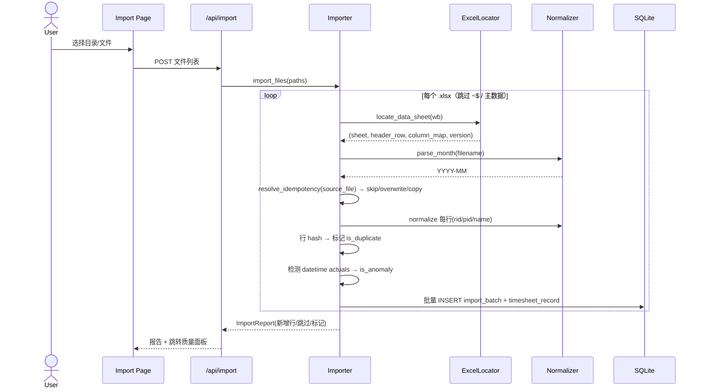
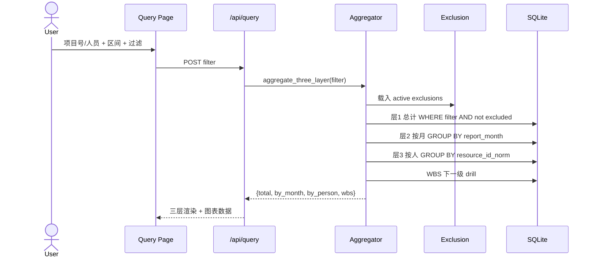
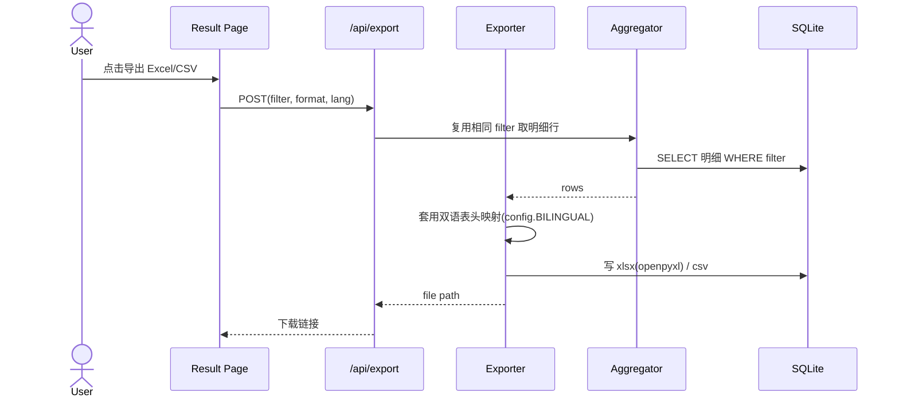

# ECAHelper 工时统计分析应用 · 系统设计与任务分解

> 版本：v1.0 ｜ 架构师：高见远 ｜ 形态：本地 Web 应用（Python 3.13 + SQLite）
> 输入基线：`docs/PRD.md`（许清楚）、`docs/附录A-源数据实测报告.md`（齐活林，45 文件全量解析）
> 读者：工程师 寇豆码（下一步批量写代码依据）

---

## 1. 实现方案与框架选型

### 1.1 推荐技术栈（明确结论，不脚踩两只船）

| 层 | 选型 | 说明 |
|----|------|------|
| 语言/运行时 | Python 3.13.12（managed runtime） | 用户确认路径 `C:\Users\Administrator\.workbuddy\binaries\python\versions\3.13.12\python.exe` |
| Web 框架 | **Flask 3.x** | 后端同时承担「API + 服务端 Jinja2 模板渲染」，单一语言、单一运行时 |
| WSGI 服务 | **Waitress**（纯 Python） | 替代 Flask 开发服务器，无 C 编译依赖，适合本机常驻 |
| 数据库 | **SQLite**（单文件 `eca_helper.db`，项目根目录） | 33,015 行且持续增长，完全够用；行级落库 + 审计标记 |
| Excel 解析 | **openpyxl 3.1.5**（已装） | 批量读取，按单元格类型识别日期型脏数据；**不依赖 pandas** |
| Excel 导出 | **openpyxl**（同上） | 写 `.xlsx`；CSV 用标准库 `csv` |
| 图表 | **ECharts 5（vendored 本地文件，无构建）** | 单 JS 文件，覆盖 Top N 排行 / 按月趋势 / 人员×项目交叉矩阵（heatmap），离线可用 |
| 前端样式/交互 | **原生 CSS + 原生 JS（vanilla）** | 三层结果折叠、AJAX 查询、导出按钮；不引入 Node 构建链 |
| 启动 | `start.bat` | 激活本地 venv → 安装依赖 → 启动 Waitress → `webbrowser` 自动开浏览器 |

### 1.2 选型权衡（Vite+React+MUI+Tailwind vs Flask+模板渲染）

| 维度 | Vite+React+MUI+Tailwind（前端 SPA） | **Flask+Jinja2+ECharts（本方案）** |
|------|--------------------------------------|--------------------------------------|
| 运行时 | Python(后端API) + Node(前端构建) 双工具链 | 仅 Python |
| 交付复杂度 | 需 `npm install` + `npm run build` 再 serve dist，两步部署 | 单 `.bat` 起 Python 即服务，零构建 |
| 离线 | 构建产物可离线，但构建期需 Node/网络 | 全离线（ECharts 已 vendored） |
| 交互能力 | 组件化、状态管理强 | 折叠/筛选/图表用原生 JS 足够（报表型工具） |
| 风险 | 引入 Node 工具链，本地单人工具收益低、风险高 | 最省事、最易交付、最稳 |

**结论**：本场景是「单人本地 + 二维表格 + 图表」的报表工具，没有复杂客户端状态。引入 React 构建链收益极低、交付风险高。**明确采用 Flask + 服务端渲染 + vendored ECharts**，不引入 Node。API 层保持干净（JSON 接口），若二期要换 SPA 可无痛替换前端。

### 1.3 架构模式

经典 **MVC + 服务层**：`routes`（Controller）→ `services/queries`（Service）→ `db`（Model/SQLite）。解析与统计逻辑下沉到 `parsers/`、`queries/`，路由只做参数校验与视图组装。模板渲染由 Jinja2 完成，图表数据走独立 JSON 接口由 `charts.js` 消费。

---

## 2. 文件清单

> 约定：项目根 = `C:\Users\Administrator\Desktop\ECAHelper\`。运行时数据文件（db / 导出）落在根目录下可预期位置。

### 2.1 后端（Python 包 `eca_helper/`）

| 路径 | 职责 |
|------|------|
| `app.py` | Flask app 工厂、路由注册、配置加载、启动（Waitress + 自动开浏览器） |
| `config.py` | 路径常量、归一化规则常量、双语字段映射表 `BILINGUAL`、业务枚举中文映射、端口配置 |
| `eca_helper/__init__.py` | 包标识 |
| `eca_helper/db.py` | SQLite 连接、建表/索引（`init_schema`）、幂等初始化 |
| `eca_helper/schema.sql` | 建表 SQL 文本（与 `db.py` 同步，便于审阅） |
| `eca_helper/parsers/excel_locator.py` | 扫描 Sheet、定位数据表头行、版本探测（v1/v2） |
| `eca_helper/parsers/field_mapper.py` | 表头→内部字段映射、列索引解析（兼容两代结构 + 多余列忽略） |
| `eca_helper/parsers/normalizer.py` | `normalize_resource_id` / `normalize_project_id` / `normalize_name` / `parse_month` / 行哈希 |
| `eca_helper/parsers/importer.py` | 导入编排：文件列表、批量插入、去重、异常标记、幂等（skip/overwrite/copy）、导入报告 |
| `eca_helper/queries/aggregate.py` | 三层聚合 SQL、综合检索过滤、WBS 下钻、exclusion 应用、Top N、组织/成本中心、缺月补 0 |
| `eca_helper/queries/export.py` | Excel(openpyxl) / CSV 双语导出 |
| `eca_helper/services/person_service.py` | 人员表维护、别名聚合、canonical 选择、合并映射（Q2） |
| `eca_helper/services/quality_service.py` | 质量指标计算、明细下钻、exclusion 勾选持久化（Q3） |
| `eca_helper/routes/import_routes.py` | `/` `/import` 页面与 `/api/import` |
| `eca_helper/routes/project_routes.py` | 项目工时查询页与 `/api/query/project` |
| `eca_helper/routes/employee_routes.py` | 员工工时查询页与 `/api/query/employee` |
| `eca_helper/routes/search_routes.py` | 综合检索页与 `/api/query/search` |
| `eca_helper/routes/quality_routes.py` | 质量面板页与 `/api/quality/*` |
| `eca_helper/routes/export_routes.py` | `/api/export` |
| `eca_helper/routes/chart_routes.py` | `/api/chart/topn` `/api/chart/trend` `/api/chart/matrix` |

### 2.2 前端（模板 + 静态）

| 路径 | 职责 |
|------|------|
| `templates/base.html` | 布局、导航、引入 ECharts/样式 |
| `templates/import.html` | 导入页（目录/文件选择、区间预览、导入报告） |
| `templates/project_query.html` | 项目工时查询页（三层 + WBS 下钻） |
| `templates/employee_query.html` | 员工工时查询页（含非项目工时单列） |
| `templates/search.html` | 综合检索页 |
| `templates/quality.html` | 数据质量面板 |
| `templates/components/three_layer.html` | 可复用三层结果块（总计/按月/按人） |
| `static/css/style.css` | 轻量样式（无 CDN，离线） |
| `static/js/echarts.min.js` | vendored 图表库（下载一次入库） |
| `static/js/charts.js` | Top N / 趋势 / 交叉矩阵渲染 |
| `static/js/app.js` | 折叠、AJAX 查询、导出交互 |

### 2.3 脚本与数据

| 路径 | 职责 |
|------|------|
| `requirements.txt` | flask, waitress, openpyxl（仅这三，均 pip 入本地 venv） |
| `setup_env.bat` | 用 managed python 建 `.venv` 并 `pip install -r requirements.txt` |
| `start.bat` | 激活 venv → `python app.py`（内部 Waitress 起服 + 开浏览器） |
| `OriginSource/` | 输入 xlsx（已存在，44 有效表 + 1 主数据 + 1 锁文件） |
| `eca_helper.db` | SQLite 库文件（运行时生成，根目录） |
| `data/exports/` | 导出 xlsx/csv 落盘（运行时生成） |

---

## 3. 数据模型（ER / 表结构）

### 3.1 实体关系

- `import_batch` 1 —— N `timesheet_record`（每次导入一批明细）
- `person` 1 —— N `timesheet_record`（以 `resource_id_norm` 关联；空 ID 归 `__UNKNOWN__`）
- `exclusion` N —— 1 `timesheet_record`（按 `target_key` 指向被排除的组/行）
- `person_merge` N —— 1 `person`（from/to 均为 `resource_id_norm`，重路由聚合）

> 说明：本期**不引入项目主数据**，故无 `project` 实体表；项目清单与 WBS 下钻均由 `timesheet_record` 的 `project_id_norm` / `wbs_nr` 实时聚合得出（见 3.4 视图）。

### 3.2 建表 SQL（SQLite 语法，含索引）

```sql
-- 每次导入一批的元信息
CREATE TABLE IF NOT EXISTS import_batch (
  id             TEXT PRIMARY KEY,            -- e.g. <filename>-<timestamp>
  source_file    TEXT NOT NULL,
  parsed_month   TEXT NOT NULL,               -- YYYY-MM（来自文件名）
  imported_at    TEXT NOT NULL,               -- ISO 8601 UTC
  row_count      INTEGER NOT NULL DEFAULT 0,
  anomaly_count  INTEGER NOT NULL DEFAULT 0,
  duplicate_count INTEGER NOT NULL DEFAULT 0,
  status         TEXT NOT NULL DEFAULT 'done',
  note           TEXT
);
CREATE INDEX IF NOT EXISTS idx_batch_month ON import_batch(parsed_month);
CREATE INDEX IF NOT EXISTS idx_batch_file  ON import_batch(source_file);

-- 人员（Resource ID 主键）
CREATE TABLE IF NOT EXISTS person (
  resource_id_norm  TEXT PRIMARY KEY,         -- 归一化主键；空 ID = '__UNKNOWN__'
  canonical_name    TEXT,                     -- 规范显示名（出现最多写法）
  name_aliases      TEXT,                     -- JSON 数组：全部姓名写法
  first_organization TEXT,
  first_cost_center   TEXT,
  first_seen_batch    TEXT,
  merged_into       TEXT                      -- 若被合并到另一 ID（Q2）
);

-- 核心明细表（行级落库 + 审计标记）
CREATE TABLE IF NOT EXISTS timesheet_record (
  id                INTEGER PRIMARY KEY AUTOINCREMENT,
  import_batch_id   TEXT NOT NULL,
  resource_id_norm  TEXT,                     -- FK person；空→'__UNKNOWN__'
  resource_id_raw   TEXT,
  name_snapshot     TEXT,
  organization      TEXT,
  cost_center       TEXT,
  wh_cost_center    TEXT,
  project_id_norm   TEXT,                     -- 归一化匹配键；NULL/空→非项目工时
  project_id_raw    TEXT,
  project_name      TEXT,
  task              TEXT,
  wbs_nr            TEXT,
  to_wbs_no         TEXT,
  to_cost_center    TEXT,
  to_internal_order TEXT,
  to_reference_proj_no TEXT,
  reference_proj_name   TEXT,
  actuals_total_h   REAL NOT NULL DEFAULT 0,  -- 异常行置 0，原值存 actuals_raw_text
  actuals_raw_text  TEXT,                     -- 日期型/异常原始值（质量面板溯源）
  transaction_group TEXT,
  site_type         TEXT,
  report_month      TEXT NOT NULL,            -- YYYY-MM（权威时间，文件名派生）
  source_file       TEXT NOT NULL,
  source_sheet      TEXT NOT NULL,
  source_row        INTEGER NOT NULL,
  is_duplicate      INTEGER NOT NULL DEFAULT 0,
  dup_group_key     TEXT,                     -- 同文件内重复组指纹（NULL=非重复）
  is_anomaly_actuals INTEGER NOT NULL DEFAULT 0,
  FOREIGN KEY (import_batch_id) REFERENCES import_batch(id)
);
CREATE INDEX IF NOT EXISTS idx_ts_batch  ON timesheet_record(import_batch_id);
CREATE INDEX IF NOT EXISTS idx_ts_proj   ON timesheet_record(project_id_norm);
CREATE INDEX IF NOT EXISTS idx_ts_person ON timesheet_record(resource_id_norm);
CREATE INDEX IF NOT EXISTS idx_ts_month  ON timesheet_record(report_month);
CREATE INDEX IF NOT EXISTS idx_ts_src    ON timesheet_record(source_file, source_row);
CREATE INDEX IF NOT EXISTS idx_ts_dup    ON timesheet_record(dup_group_key);

-- 统计排除规则（Q3：默认不排除，勾选后持久化）
CREATE TABLE IF NOT EXISTS exclusion (
  id          INTEGER PRIMARY KEY AUTOINCREMENT,
  category    TEXT NOT NULL,   -- 'duplicate'|'anomaly'|'zero'|'empty_rid'
  target_key  TEXT NOT NULL,   -- duplicate: source_file+'#'+hash; 其余: source_file+'|'+source_row
  excluded    INTEGER NOT NULL DEFAULT 0,
  created_at  TEXT,
  UNIQUE(category, target_key)
);

-- 人员合并映射（Q2：默认不自动，手动合并）
CREATE TABLE IF NOT EXISTS person_merge (
  id          INTEGER PRIMARY KEY AUTOINCREMENT,
  from_resource_id_norm TEXT NOT NULL,
  to_resource_id_norm   TEXT NOT NULL,
  created_at  TEXT,
  note        TEXT
);

-- 查询快照（P2-3，预留）
CREATE TABLE IF NOT EXISTS saved_view (
  id          INTEGER PRIMARY KEY AUTOINCREMENT,
  name        TEXT NOT NULL,
  query_type  TEXT NOT NULL,
  params      TEXT NOT NULL,   -- JSON
  created_at  TEXT
);
```

### 3.3 归一化规则（落库前执行）

| 字段 | 规则 |
|------|------|
| `resource_id_norm` | `str(v).strip().upper()`；空/None → `'__UNKNOWN__'` |
| `project_id_norm` | 空/None → `NULL`（非项目工时）；否则 `str(v).strip().upper()`（先统一转字符串，故 `int 70463`/`float 0.0001` 都可比）；Excel 读成 `0.0001` 的 float 用 `str()` 保形 |
| `name` | 原始写法原样存 `name_snapshot`；别名聚合进 `person.name_aliases`；`canonical_name` = 出现频次最高的写法 |
| `report_month` | 仅来自文件名（见 4.3） |
| `cost_center` / `wh_cost_center` | 统一转字符串，保留前导零 |

### 3.4 项目清单 / WBS 下钻（视图或聚合，不建表）

- **项目清单视图**：`SELECT DISTINCT project_id_norm, project_id_raw, project_name FROM timesheet_record WHERE project_id_norm IS NOT NULL;`（`project_name` 取同 `project_id_norm` 下出现最多的名称作 canonical）
- **WBS 下钻**：按 `wbs_nr` 以 `.` 分段取「下一级前缀」聚合。`prefix` 含 k 个点，则下一级 key = `wbs_nr` 截取到第 k+1 个点；递归逐层下钻，各层合计与项目总工时一致（算法在 `aggregate.py` 的 `wbs_drill`）。

---

## 4. 关键业务逻辑

### 4.1 文件定位算法（`excel_locator.py`）

```
输入：一个 .xlsx 路径
1. 跳过规则：文件名以 '~$' 开头 → 锁文件跳过；匹配 '在管项目' → 主数据跳过（本期不导入）
2. openpyxl.load_workbook(path, read_only=True, data_only=True)
3. 忽略前两张 Sheet（均为透视表）；从第 3 张起遍历（若文件仅 1~2 张 Sheet 则无数据表 → 返回 '无法定位'）
4. 对每张候选 Sheet，扫描前 5 行，查找「同时含 'Resourcename' 与 'Actuals Total in h'（大小写/空白归一后）」的行 → 记作 header_row
5. 找到则返回 (sheet, header_row, header_cells)；否则尝试下一张；全失败 → 返回无法定位
```
> 实测覆盖：`2024.12`(1 张)、`2024.10`(2 张)、`2023.2`(表头第 1 行)、v2(表头第 2/3 行) 均可定位。

### 4.2 两代表头 → 内部字段映射（`field_mapper.py`）

按「表头文本归一化」（lower + strip + 连续空格折叠 + 去尾点）做键，查映射字典得到内部字段与列索引。**缺失列 → 列索引 None → 落库 NULL**；未知列（如 v1 游离日期列、2023.10 的 `real CC`）→ 无映射 → 忽略。

| 内部字段 | v1 表头（9 列） | v2 表头（16~17 列） |
|----------|----------------|---------------------|
| name | Resourcename | Resourcename |
| resource_id | Resource ID | Resource ID |
| organization | Organization | Organization |
| cost_center | Cost Center | Cost Center |
| wh_cost_center | —（NULL） | WH Cost Center |
| project_id | Project ID | Project ID |
| project_name | Project | Project |
| task | Task | Task |
| wbs_nr | WBS Nr | WBS Nr |
| to_wbs_no | — | To WBS No. |
| to_cost_center | — | To Cost Center |
| to_internal_order | — | To Internal Order |
| to_reference_proj_no | — | To Reference Proj.No. |
| reference_proj_name | — | Reference Proj.Name |
| actuals_total_h | Actuals Total in h | Actuals Total in h |
| transaction_group | — | Transaction Group |
| site_type | — | Site Type（部分文件无） |

版本探测：`'wh cost center'` 在表头中 → v2；否则 v1（仅用于报告标注，映射按列名逐个解析，顺序无关）。

### 4.3 月份解析正则（`normalizer.py`）

```python
import re
MONTH_RE = re.compile(r'(20\d{2})\.(\d{1,2})')
def parse_month(filename: str) -> str | None:
    m = MONTH_RE.search(filename)
    if not m: return None
    y, mo = m.group(1), int(m.group(2))
    if 1 <= mo <= 12:
        return f"{y}-{mo:02d}"
    return None
```
- 覆盖：`Timesheet of 2023.6 including SC.xlsx`→`2023-06`；`2025.01including SC.xlsx`→`2025-01`（月份与 `including` 缺空格仍能匹配 `2025.01`）；`2024.12.xlsx`→`2024-12`。
- 解析失败 → 文件列入「解析失败」并跳过导入（不静默）。
- **只认文件名**，忽略表内 `From...to...` 与游离日期列（附录A 已证不可信）。

### 4.4 归一化函数（`normalizer.py`）

```python
def normalize_resource_id(v):
    if v is None: return '__UNKNOWN__'
    s = str(v).strip().upper()
    return '__UNKNOWN__' if s == '' else s

def normalize_project_id(v):
    if v is None: return None
    s = str(v).strip().upper()          # int/float 先转 str 再清洗
    return None if s == '' else s

def normalize_name(v):
    return str(v).strip() if v is not None else ''
```
- 验证：`O 1900.008` / `E20067-000 ` / `70463`(int) / `0.0001`(float) / `O 1341.176.01.01.0028` → 各自可归一化并被精确命中；查 `O 1900.008` 命中存储为 `O 1900.008 `（尾空格）的行。
- 人员别名：`('', '', ...)` 空 ID → `__UNKNOWN__` 桶；`waxi`/`WAXI`、`Li, Bo`/`Li Bo`/`Li，Bo` 归同一 ID 别名列表。

### 4.5 重复行检测（整行 hash，按文件）

```
对单个文件解析出的数据行：
  取业务列元组 (resource_id_raw, project_id_raw, name_snapshot, organization,
               cost_center, task, wbs_nr, to_wbs_no, actuals_raw_text, report_month)
  计算稳定哈希 -> group_key = source_file + '#' + hash[:12]
  同 group_key 出现 >1 次 -> 首行以外全部 is_duplicate=1，dup_group_key=group_key
```
- 范围限定在**同一文件**（不同月份同内容属正常，不误判）。
- 实测：33 个源文件存在重复，共 137 行 / 100 个重复组，绝大多数重复 2 次。

### 4.6 异常检测（Actuals 日期型）

```
读单元格 c：
  if isinstance(c.value, (datetime, date)): is_anomaly_actuals=1; actuals_total_h=0.0; actuals_raw_text=str(c.value)
  elif c.value is None or c.value=='':      actuals_total_h=0.0   (计 0 工时行)
  elif 可转 float:                          actuals_total_h=float
  else:                                     is_anomaly_actuals=1; actuals_total_h=0.0; actuals_raw_text=str(c.value)
```
- 实测：异常 Actuals = 14 行，全在 `2023.2`（Excel 把工时存成日期如 `1900-01-16`）。
- 0 工时行 = 93 行（其中 14 行为异常占位、真正 0 工时 79 行；无负工时），计入行数、合计 0。

### 4.7 三层聚合查询 SQL（`aggregate.py`）

> 所有查询统一套用 exclusion 过滤（见 4.8）。以下以「按项目号」为例，员工/综合仅过滤条件不同。

**层1 总计**：
```sql
SELECT SUM(actuals_total_h) AS total_h, COUNT(*) AS rows,
       COUNT(DISTINCT resource_id_norm) AS persons,
       COUNT(DISTINCT report_month) AS months
FROM timesheet_record r
WHERE project_id_norm = :pid AND report_month BETWEEN :m_start AND :m_end
  AND <exclusion_clause>;
```

**层2 按月**：
```sql
SELECT report_month, SUM(actuals_total_h) AS h, COUNT(*) AS rows
FROM timesheet_record r
WHERE project_id_norm = :pid AND report_month BETWEEN :m_start AND :m_end
  AND <exclusion_clause>
GROUP BY report_month ORDER BY report_month;
-- 应用层对 [m_start, m_end] 内无数据的月份补 0（趋势图不断裂）
```

**层3 按人**：
```sql
SELECT resource_id_norm, name_snapshot, SUM(actuals_total_h) AS h, COUNT(*) AS rows
FROM timesheet_record r
WHERE project_id_norm = :pid AND report_month BETWEEN :m_start AND :m_end
  AND <exclusion_clause>
GROUP BY resource_id_norm ORDER BY h DESC;
```

**员工查询差异**：项目维度 `WHERE project_id_norm IS NOT NULL`（排除空项目号）；人员维度 `WHERE resource_id_norm = :rid` 全量，空项目号行归类为「非项目工时」按 `task` 细分（Leave / Procurement services / 其他）。某人总工时 = 项目工时 + 非项目工时。

**综合检索**：在以上 WHERE 叠加可选 `organization` / `cost_center` / `task` / `resource_id_norm` / `project_id_norm` / `含空项目号` 过滤。

**WBS 下钻**：取 `wbs_nr LIKE :prefix || '.%'` 的行，按「下一级前缀」聚合（Python 侧 `wbs_drill`）。

**Top N（P1）**：按 `resource_id_norm` / `project_id_norm` / `organization` 聚合工时 `ORDER BY h DESC LIMIT :n`。

**组织/成本中心（P1）**：`GROUP BY organization` / `GROUP BY cost_center`（代码作字符串，保前导零）。

### 4.8 统计排除过滤（Q3）

```sql
-- <exclusion_clause> 统一形态：
AND NOT EXISTS (
  SELECT 1 FROM exclusion e WHERE e.excluded = 1 AND (
    (e.category='duplicate' AND r.dup_group_key IS NOT NULL AND e.target_key = r.dup_group_key)
    OR (e.category='anomaly'  AND e.target_key = r.source_file || '|' || r.source_row)
    OR (e.category='zero'     AND e.target_key = r.source_file || '|' || r.source_row)
    OR (e.category='empty_rid' AND e.target_key = r.source_file || '|' || r.source_row)
  )
)
```
默认 `exclusion` 表为空 → 统计含全部原始行（与「保留原始行、默认不排除」一致）；用户在质量面板勾选后写入 `excluded=1` 并持久化。

---

## 5. 接口 / 调用流程

> 以下为关键流程的 Mermaid 时序图（另存于 `docs/sequence-diagram.mermaid`）。

### 5.1 导入流程



### 5.2 查询流程



### 5.3 导出流程



---

## 6. 任务分解（有序，标注依赖）

> 说明：本系统含「Excel 解析（两代结构）+ 多页 UI + 图表 + 导出」，模块面较宽；为直接指导工程师批量写码，采用**模块级任务**（每条 3+ 文件、含产出与验收点），而非文件级碎任务。依赖以「先做 / 可并行」标注。

| ID | 任务 | 依赖 | 优先级 | 产出 | 验收点 |
|----|------|------|--------|------|--------|
| T01 | 项目脚手架与启动脚本 | — | P0 | `requirements.txt`, `setup_env.bat`, `start.bat`, `app.py`(app 工厂+config 加载+开浏览器), `config.py`(路径常量) | 双击 `start.bat`：建 `.venv`、装依赖、Waitress 起 `http://127.0.0.1:5000`、浏览器自动打开、占位首页可见 |
| T02 | 数据库 schema 与初始化 | T01 | P0 | `eca_helper/db.py`, `eca_helper/schema.sql` | 首启生成 `eca_helper.db`，含 6 表+索引；重复调用幂等 |
| T03 | Excel 定位与字段映射 | T01 | P0 | `parsers/excel_locator.py`, `parsers/field_mapper.py` | 单测覆盖 2024.12/2024.10/2023.2/v2；返回 header_row+column_map；`~$`/主数据被过滤 |
| T04 | 归一化与解析基础 | T01 | P0 | `parsers/normalizer.py` | 5 种 project 形态→可比 key；44 文件名月份全过（含 `2025.01including`）；空 ID→`__UNKNOWN__` |
| T05 | 导入管线（批量/幂等/去重/异常） | T02,T03,T04 | P0 | `parsers/importer.py`, `import_routes.py` | 导 44 文件→33,015 行；重复 33 文件标记；异常 14 行(2023.2)；同名重导默认 skip 不翻倍；任意行可 `source_file+source_row` 回溯 |
| T06 | 人员维度与合并服务 | T02,T04,T05 | P0/P2 | `services/person_service.py`, `person_routes`(并入各 query 路由) | 260 ID 唯一；别名聚合正确；任一别名可命中；合并后聚合重路由（P2 默认不自动） |
| T07 | 三层聚合与多维检索引擎 | T02,T05 | P0/P1 | `queries/aggregate.py`, `project_routes.py`, `employee_routes.py`, `search_routes.py` | P0-6/7/8/9/10 三层一致；空 PID 项目维度排除、人员维度保留非项目工时；WBS 下一级一致；组织/成本中心正确；exclusion 生效 |
| T08 | 数据质量面板服务 | T05,T07 | P0 | `services/quality_service.py`, `quality_routes.py` | 面板数字与库一致（空 PID 6589/重复 33/异常 14/0 工时 93/变体 197-260）；可下钻 `source_row`；勾选排除持久化 |
| T09 | 导入页 UI | T05,T08 | P0 | `templates/import.html`, `static/js/app.js`(导入部分) | 选目录/文件→预览 44 文件+区间；开始导入→报告（新增行/跳过/标记）；跳质量面板 |
| T10 | 项目/员工/综合查询页 UI + 三层组件 | T07 | P0 | `templates/project_query.html`, `employee_query.html`, `search.html`, `components/three_layer.html` | 三层展示；区间+快捷按钮（今年/去年/全部/单季）；非项目工时单列；WBS 下钻可展开 |
| T11 | 图表（Top N / 趋势 / 交叉矩阵） | T07,T10 | P1/P2 | `static/js/echarts.min.js`(vendored), `static/js/charts.js`, `chart_routes.py` | Top N（维度/N 可配）；按月趋势（缺月补 0）；人员×项目矩阵（合计一致）；离线可用 |
| T12 | 导出（Excel/CSV 中英双语） | T07 | P0 | `queries/export.py`, `export_routes.py` | 导出含双语表头；xlsx 与 csv 一致；范围=当前查询；业务枚举可选中文映射（Q7） |
| T13 | 收尾：常量/双语映射/联调 | T09,T10,T11,T12 | P0/P1 | `config.py` 补全、`BILINGUAL` 映射表、目录约定文档、全流程联调 | 导入→查询→图表→导出全流程跑通；共享知识落地；`start.bat` 一键可用 |

**并行关系**：T03/T04 可在 T02 完成后与 T05 并行推进；T06 可与 T07 并行；T09/T10/T11/T12 均依赖 T07，但彼此可并行。

---

## 7. 依赖包清单

> 全部装入项目本地 `.venv`（由 managed python 3.13.12 创建），**不污染全局 managed runtime**。`start.bat` 自动 `setup_env.bat` 安装。

| 包 | 版本 | 用途 | 是否需安装 |
|----|------|------|-----------|
| flask | ^3.0 | Web 框架 + Jinja2 模板 | 是（venv） |
| waitress | ^3.0 | 纯 Python WSGI 服务，本机常驻 | 是（venv） |
| openpyxl | 3.1.5 | Excel 解析与导出（已装于环境，venv 内重装锁定） | 是（venv） |
| echarts | 5.x | 前端图表（**vendored 静态文件**，不进 pip） | 否（下载一次入 `static/js/`） |

> 不引入：pandas（环境未装且禁止全局安装）、Node/React 构建链、任何 CDN 依赖（离线优先）。

---

## 8. 共享知识（跨文件约定）

- **目录结构**：根 `ECAHelper/` → `eca_helper/`(包)、`templates/`、`static/`、`OriginSource/`(输入)、`eca_helper.db`(库)、`data/exports/`(导出)、`docs/`(文档)、`requirements.txt`、`start.bat`、`setup_env.bat`。
- **命名规范**：Python `snake_case` + 包 `eca_helper`；表/`snake_case`；内部字段与 DB 列名一致；模板 `kebab-case.html`；常量全大写（`DB_PATH`、`ORIGIN_DIR`、`EXPORT_DIR`、`APP_PORT`）。
- **路径常量（config.py）**：
  - `ROOT = C:\Users\Administrator\Desktop\ECAHelper`
  - `DB_PATH = ROOT/eca_helper.db`
  - `ORIGIN_DIR = ROOT/OriginSource`
  - `EXPORT_DIR = ROOT/data/exports`
  - `APP_PORT = 5000`（冲突自动 +1）
- **时间格式**：内部统一 `YYYY-MM`（字符串），展示升序；快捷按钮：今年 / 去年 / 全部 / 单季（当前自然季 + 下拉选年月）。
- **归一化常量**：`__UNKNOWN__`（空 Resource ID 桶）；project 空→`NULL`。
- **双语字段映射表（config.BILINGUAL，导出表头与质量面板用）**：

  | 内部字段 | EN | ZH |
  |----------|----|----|
  | project_id_norm | Project ID | 项目号 |
  | resource_id_norm | Resource ID | 资源号 |
  | name_snapshot | Resourcename | 姓名 |
  | organization | Organization | 组织 |
  | cost_center | Cost Center | 成本中心 |
  | project_name | Project | 项目名称 |
  | task | Task | 任务 |
  | wbs_nr | WBS Nr | WBS 编号 |
  | actuals_total_h | Actuals Total in h | 实际工时(h) |
  | report_month | Report Month | 报告月份 |
  | source_file | Source File | 源文件 |
  | source_row | Source Row | 源行号 |

- **业务枚举中文映射（Q7，可选附注列）**：`Leave=休假`、`Procurement services=采购服务`、`SCF (Annual Leave)=年假`、`SCF (Sick Leave)=病假`。
- **排除默认**：`exclusion` 初始为空 → 统计含全部原始行；勾选后 `excluded=1` 持久化。
- **幂等默认**：同名文件重导 → 默认 `skip`（不静默翻倍）；提供 `overwrite`/`copy` 选项。

---

## 9. 待明确事项（PRD Q1–Q8 + 技术侧补充）

> 以下均给出技术侧建议，**已于 2026-09-21 全部确认，取值与设计书总览 §4 一致**：Q1 空ID→`__UNKNOWN__`；Q2 默认不自动合并（WATA/WATA02 为不同人，合并候选须保守）；Q3 默认不排除、可勾选持久化；Q4 同名重导默认跳过；Q5 单季=当前自然季；Q6 仅提示不归一；Q7 双语含可选业务值映射；Q8 0 工时计入行数；+1 ECharts vendored；+2 端口 5000+1；+3 导出命名规则。全部采用技术侧建议。

| # | 问题 | 技术侧建议 |
|---|------|-----------|
| Q1 | 空 Resource ID 行归属？ | P0 原样落库，`resource_id_norm='__UNKNOWN__'`，统计归「未标识人员」桶；不强制合并。**建议接受** |
| Q2 | 同一人多 ID（WATA/WATA02 等）自动合并？ | 默认**不自动合并**；质量面板给「疑似同 ID 候选」+手动合并开关，合并写 `person_merge` 重路由。**建议同意** |
| Q3 | 标记行如何「用户决定是否处理」？ | 质量面板每个重复/异常组给「从统计排除」勾选，状态存 `exclusion`，**默认不排除**。**建议同意默认含全部** |
| Q4 | 同名月份文件重导？ | 导入检测 `source_file` 已存在 → 提示 覆盖/跳过/副本，**默认跳过**。**建议同意** |
| Q5 | 「单季」指哪个季？ | 默认「当前自然季」（系统日期），提供下拉选 年+季。**建议同意** |
| Q6 | 组织 v1/v2 口径不一致？ | 如实展示原始值，UI 标「跨版本口径可能不一致」提示，不强行归一；`SX**` 与主流并列。**建议仅提示不合并** |
| Q7 | 导出双语是否含业务枚举值？ | 表头字段名双语（必做）；Task 等业务枚举提供**可选中文映射**作附注列/附表。**建议做映射** |
| Q8 | 0 工时行（93 行）计入？ | 保留并计入行数，工时 0 不影响合计；质量面板单列口径。**建议计入行数、合计 0** |
| +1 | 图表库选 ECharts vendored 是否接受？ | 推荐 ECharts 单文件 vendored（离线、覆盖排行/趋势/矩阵）。Chart.js 备选（矩阵需插件）。**建议 ECharts** |
| +2 | 启动端口固定还是随机？ | 固定 5000，被占用则 +1 重试；浏览器开对应 URL。**建议固定+回退** |
| +3 | 导出文件命名？ | `导出_<查询类型>_<YYYYMMDD_HHMM>.<xlsx|csv>` 落 `data/exports/`。**建议此规则** |

---

*附图：类图见 `docs/class-diagram.mermaid`；时序图见 `docs/sequence-diagram.mermaid`。*
