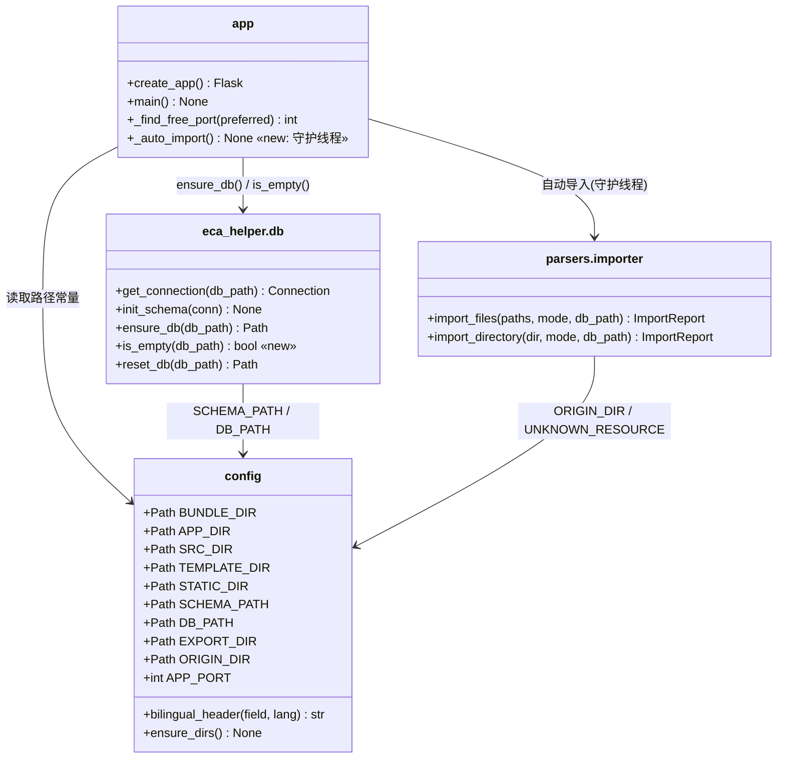
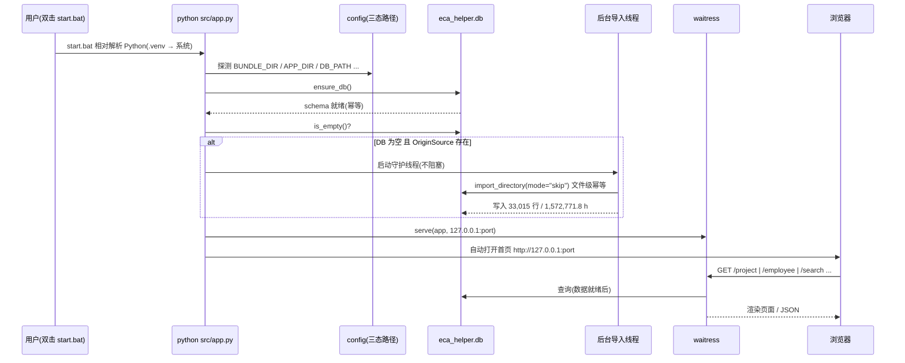
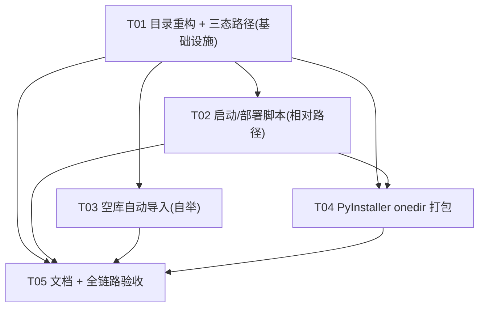

# ECAHelper 重构设计书（结构 / 可移植 / 部署）

> 版本：v1.0 ｜ 编制：架构师（software-architect-2）
> 状态：**设计定稿（仅设计，未改代码、未移动文件）**
> 适用范围：在**不改变任何业务/解析/聚合逻辑**的前提下，完成目录重构、路径可移植化与部署打包。
> 硬约束：保留 `docs/设计书总览.md` §1 的 12 项锁定决策与 §4 已确认开放问题；导入管线必须仍精确对账 **33,015 行 / 1,572,771.8 h**。

---

## 0. 目标与不变量（TL;DR）

**目标**：把当前「根目录平铺」的布局，重构为「后端 `src/` + 前端 `web/` + 运行数据 `data/`」的清晰布局，并做到：

1. **完全去绝对路径**：整目录可复制到任意绝对路径（模拟换机）后双击即用。
2. **无内置 Python 运行时**：改为交付「部署脚本 + 文档 + PyInstaller 打包脚本」。
3. **空库自举**：启动时若 DB 缺失/为空，自动导入 `OriginSource`（幂等、不阻塞服务）。
4. **交付物**：一键部署脚本、PyInstaller **onedir** 打包脚本、部署手册。

**不变量（本次绝不动）**：

- 归一化/字段映射/去重/异常检测/三层聚合/导出 的**算法与 SQL 一律不改**（仅搬迁 + 路径处理）。
- 顶层模块名保持不变：仍以 `config`（配置模块）与 `eca_helper`（业务包）作为**顶层导入名**，从而**不改任何模块内的 `import` 语句文本**（降低回归风险）。
- 模板/静态资源通过 Flask 的 `template_folder` / `static_folder` 定位，`url_for('static', ...)` 语义不变 → **模板文件零改动**。

**对账锚点（回归红线）**：行 **33,015**、总工时 **1,572,771.8 h**、空项目号 **6,589**、重复文件 **33**、异常 **14**、0 工时 **93**、Resource ID **260**、含别名变体 **197**。

---

# Part A：系统设计

## 1. 实现思路（Implementation Approach）

### 1.1 核心技术难点

| 难点 | 说明 | 应对 |
|------|------|------|
| **三态路径解析** | 同一份代码要在「开发直跑 / 项目内 venv 跑 / PyInstaller 冻结 onedir」三种模式下正确定位：模板、静态、schema、DB、导出、源数据 | 在 `config.py` 引入唯一的**基准目录探测函数**，区分「只读资源根 `BUNDLE_DIR`」与「可写数据根 `APP_DIR`」，其余路径全部由这两者派生 |
| **只读 vs 可写分离** | 冻结后模板/静态随 exe 打包（只读、在 `_MEIPASS`），DB/导出必须可写（在 exe 同级目录，**不能写进临时解包目录**，否则退出即丢） | `BUNDLE_DIR`（资源）与 `APP_DIR`（数据）**分离**，冻结态 `APP_DIR = exe 所在目录` |
| **schema.sql 的冻结读取** | `db.py` 原用 `__file__` 读同目录 `schema.sql`，冻结后 `__file__` 非真实文件路径 | 把 schema 路径收敛到 `config.SCHEMA_PATH`，并用 PyInstaller `--add-data` 落到 `_MEIPASS/eca_helper/schema.sql` |
| **顶层模块搬迁后的 sys.path** | `config` 与 `eca_helper` 从根目录移入 `src/`，需保证三种模式都能 `import config` / `from eca_helper...` | 保留顶层模块名；仅在**非冻结**模式注入 `src/` 到 `sys.path`；冻结模式由 PyInstaller 引导器负责 |
| **空库自举不阻塞服务** | 首启需导入 44 文件（数十秒），但不能卡死 Web 服务/黑窗 | `ensure_db()` 后**后台守护线程**执行自动导入；`waitress` 立即起服务 |
| **离线 pip 陷阱** | 离线会把 `flask` 解析成不兼容的 **0.10.1** | 固定 `requirements.txt`（`flask>=3.1,<4` + werkzeug 3.x 下限），部署脚本一律 `pip install -r requirements.txt` |

### 1.2 技术与依赖选型（无需新增框架）

- **保持原栈**：Python 3.13 + Flask 3.1 + Waitress 3 + SQLite + openpyxl 3.1.5 + 原生 SVG。
- **新增仅构建期依赖**：`pyinstaller>=6.0`（仅打包用，放 `requirements-dev.txt`，不进运行时依赖）。
- **不引入** Node / React / pandas / CDN（离线优先原则保持）。

### 1.3 架构模式

沿用既有**分层架构**（保持不动，仅搬迁）：`routes`（蓝图层）→ `services`/`queries`（业务层）→ `parsers`/`db`（数据层）→ SQLite。本次重构只调整**物理目录**与**路径解析基础设施**，逻辑分层不变。

---

## 2. 目标文件树与 before → after 路径映射

### 2.1 目标目录树（After）

```
ECAHelper/
├─ src/                          # 后端（新增目录）
│  ├─ app.py                     # 入口（Flask 工厂 + waitress + 自动开浏览器 + 空库自举）
│  ├─ config.py                  # 全局配置 + 三态路径解析（唯一路径真源）
│  └─ eca_helper/                # 业务包（整体搬迁）
│     ├─ __init__.py             # sys.path 引导（冻结感知）
│     ├─ db.py                   # 连接/建库/空库判定
│     ├─ schema.sql              # 建表脚本（随包以 data 方式分发）
│     ├─ parsers/                # normalizer / excel_locator / field_mapper / importer
│     ├─ services/               # person_service / quality_service
│     ├─ queries/                # aggregate / export
│     └─ routes/                 # import/project/employee/search/quality/export/chart
├─ web/                          # 前端（新增目录）
│  ├─ templates/                 # 6 页面 + components/three_layer.html
│  └─ static/                    # css/style.css · js/app.js · js/charts.js
├─ data/                         # 运行期数据（新增目录）
│  ├─ eca_helper.db              # SQLite（从根目录迁入）
│  └─ exports/                   # 导出目录（.gitkeep）
├─ OriginSource/                 # 源 Excel（保持原位，不随 exe 打包）
├─ tools/                        # 验证脚本（保持位置，仅修 ROOT 计算）
├─ docs/                         # 文档（新增 重构设计书.md、部署手册.md）
├─ requirements.txt              # 运行时依赖（固定版本）
├─ requirements-dev.txt          # 构建期依赖（pyinstaller）
├─ start.bat                     # 启动（相对解析 Python）
├─ setup_env.bat                 # 仅建 venv + 装依赖
├─ deploy.bat                    # 一键部署（检测→venv→装依赖→启动）
├─ build_exe.bat                 # PyInstaller 打包（onedir）
├─ ECAHelper.spec                # PyInstaller 规格文件
├─ .gitignore                    # 更新忽略项
└─ LICENSE
```

### 2.2 精确 before → after 映射

| 类别 | Before（当前） | After（目标） |
|------|----------------|----------------|
| 入口 | `app.py` | `src/app.py` |
| 配置 | `config.py` | `src/config.py` |
| 后端包 | `eca_helper/`（整个目录） | `src/eca_helper/`（整体搬迁，内部结构不变） |
| 模板 | `templates/`（含 `components/three_layer.html`） | `web/templates/`（内部结构不变） |
| 静态 | `static/`（`css/style.css`、`js/app.js`、`js/charts.js`） | `web/static/`（内部结构不变） |
| 数据库 | `eca_helper.db`（根目录） | `data/eca_helper.db` |
| 导出 | `data/exports/`（旧约定根 `data/`） | `data/exports/`（语义不变，归属 `data/`） |
| 源数据 | `OriginSource/` | `OriginSource/`（**不动**） |
| 验证脚本 | `tools/*.py`（**硬编码 `C:/.../ECAHelper`**） | `tools/*.py`（改为 `parents[1]` 相对计算，见 §6） |
| 文档 | `docs/*` | `docs/*` + 新增 `docs/重构设计书.md`、`docs/部署手册.md` |
| 依赖 | `requirements.txt`（已 pin flask/waitress/openpyxl） | `requirements.txt`（扩充固定）+ `requirements-dev.txt`（新增） |
| 启动脚本 | `start.bat`、`setup_env.bat`（**硬编码 managed python / venv 绝对路径**） | 改为相对解析（§4）；新增 `deploy.bat`、`build_exe.bat`、`ECAHelper.spec` |

> 说明：`eca_helper` 包内部**逐文件路径整体平移**，唯一被改动的 3 个文件是 `config.py`、`app.py`、`eca_helper/__init__.py`，外加 `eca_helper/db.py` 的 schema 路径一行；业务/解析模块（`normalizer/excel_locator/field_mapper/importer/aggregate/export/*_service/*_routes`）**逐字不动**。

---

## 3. 路径解析策略（三模式）

### 3.1 唯一真源：`config.py` 的双基准

在 `config.py` 顶部引入如下探测（伪代码，供工程师实现）：

```python
import sys
from pathlib import Path

def _detect():
    if getattr(sys, "frozen", False):          # PyInstaller 冻结（onedir）
        bundle = Path(getattr(sys, "_MEIPASS", Path(sys.executable).parent))  # 只读资源
        appdir = Path(sys.executable).resolve().parent                        # 可写数据
        return bundle, appdir
    src_dir = Path(__file__).resolve().parent  # 源运行：config.py 在 src/
    root    = src_dir.parent                   # 项目根（含 src/web/data/OriginSource）
    return root, root                          # 非冻结：资源根 == 数据根 == 项目根

BUNDLE_DIR, APP_DIR = _detect()
_FROZEN = getattr(sys, "frozen", False)
SRC_DIR = Path(__file__).resolve().parent if not _FROZEN else APP_DIR
ROOT    = APP_DIR   # 兼容旧引用；语义 = 可写数据根

TEMPLATE_DIR = BUNDLE_DIR / "web" / "templates"
STATIC_DIR   = BUNDLE_DIR / "web" / "static"
SCHEMA_PATH  = (BUNDLE_DIR / "eca_helper" / "schema.sql") if getattr(sys, "frozen", False) \
               else (Path(__file__).resolve().parent / "eca_helper" / "schema.sql")
DB_PATH      = APP_DIR / "data" / "eca_helper.db"
EXPORT_DIR   = APP_DIR / "data" / "exports"
ORIGIN_DIR   = APP_DIR / "OriginSource"
```

### 3.2 三模式逐项解析表

| 资源 | ① 开发直跑 (`python src/app.py`) | ② 项目内 venv (`<root>\.venv\Scripts\python src\app.py`) | ③ 冻结 onedir (`dist\ECAHelper\ECAHelper.exe`) |
|------|-------------------------------|-------------------------------------------------------|---------------------------------------------|
| **`BUNDLE_DIR`**（只读资源根） | `<root>` | `<root>` | `<_MEIPASS>`（即 `dist\ECAHelper\_internal`） |
| **`APP_DIR`**（可写数据根） | `<root>` | `<root>` | `<exe 所在目录>`（`dist\ECAHelper`） |
| `config.py` | `src/config.py`（`__file__`） | 同左 | 打包为顶层模块 `config`（由引导器加载） |
| `app.py` | `src/app.py`（`__file__`） | 同左 | 入口脚本，`__file__` 指向 bundle；**冻结时不做 sys.path 注入** |
| `templates/` | `<root>/web/templates` | 同左 | `<_MEIPASS>/web/templates` |
| `static/` | `<root>/web/static` | 同左 | `<_MEIPASS>/web/static` |
| `schema.sql` | `<root>/src/eca_helper/schema.sql` | 同左 | `<_MEIPASS>/eca_helper/schema.sql` |
| `eca_helper.db` | `<root>/data/eca_helper.db` | 同左 | `<exe_dir>/data/eca_helper.db` |
| `exports/` | `<root>/data/exports` | 同左 | `<exe_dir>/data/exports` |
| `OriginSource/` | `<root>/OriginSource` | 同左 | `<exe_dir>/OriginSource`（**由打包脚本复制到 exe 同级，不打进包**） |
| 顶层导入名 | `config` / `eca_helper`（`src/` 在 `sys.path[0]`） | 同左 | `config` / `eca_helper`（打包为顶层模块） |

### 3.3 各模式生效的 sys.path 策略

- **① 开发直跑**：`python src\app.py` → `sys.path[0] = <root>/src` 天然成立；`eca_helper/__init__.py` 再兜底把 `<root>/src` 注入一次。
- **② venv 跑**：与①等价（venv 只换解释器，不改脚本目录语义）。
- **③ 冻结**：**禁止**手工改 `sys.path`（`_MEIPASS` 由引导器管理）；`config` 与 `eca_helper` 由 PyInstaller 静态分析从 `src/app.py` 的显式 import 收集为顶层模块，直接可导入。

> 关键点：`app.py` 与 `eca_helper/__init__.py` 中的 `sys.path.insert` 必须加 `if not getattr(sys, "frozen", False):` 守卫。

---

## 4. 部署与构建脚本设计

### 4.1 脚本清单与职责

| 文件名 | 职责 |
|--------|------|
| `deploy.bat` | **一键部署**：定位 Python → 创建项目内 `.venv` → `pip install -U pip` → `pip install -r requirements.txt` → 调用 `start.bat` |
| `start.bat` | **启动**：相对解析 Python（优先 `<root>\.venv`，其次系统 `python`/`py -3`，都没有则**明确报错**）→ 运行 `src\app.py`，输出写入 `startup.log` |
| `setup_env.bat` | （保留）仅建 venv + 装依赖，不启动 |
| `build_exe.bat` | **打包**：确保 venv 有 `pyinstaller` → 执行 `pyinstaller ECAHelper.spec` → 把 `OriginSource\`、空 `data\` 复制到 `dist\ECAHelper\` |
| `ECAHelper.spec` | PyInstaller **onedir** 规格（入口、数据文件、hidden imports） |

### 4.2 `start.bat` 相对 Python 解析（核心改动）

```
1) setlocal; cd /d "%~dp0"
2) 若存在 "%CD%\.venv\Scripts\python.exe" → 用它（RELOCATABLE，项目内相对）
3) 否则 where python / where py → 用系统解释器（并校验 `-c "import flask,openpyxl"`）
4) 否则 where py → py -3
5) 都没有 or 缺依赖 → echo 明确指引（先跑 deploy.bat）→ pause 退出
6) "%PY%" -u "src\app.py" > "%CD%\startup.log" 2>&1
```

要点：**不再出现任何 `C:\Users\...` 绝对路径**；Python 一律相对/环境探测。

### 4.3 `deploy.bat` 流程

```
cd /d "%~dp0"
探测 Python:  py -3  →  python  →  报错退出（附 python.org 提示）
if not exist ".venv\Scripts\python.exe" ( %PY% -m venv ".venv" )
".venv\Scripts\python.exe" -m pip install -U pip
".venv\Scripts\python.exe" -m pip install -r "requirements.txt"
call start.bat
```

### 4.4 PyInstaller onedir 打包（`ECAHelper.spec` + 等价 CLI）

**规格文件（推荐，作为唯一真源）**：

```python
# ECAHelper.spec
# 冻结 onedir；模板/静态/schema 作为只读资源随包；DB/exports/OriginSource 落在 exe 同级
a = Analysis(
    ['src/app.py'],
    pathex=['src'],                       # 让分析器找到顶层 config 与 eca_helper 包
    datas=[
        ('web/templates', 'web/templates'),
        ('web/static',    'web/static'),
        ('src/eca_helper/schema.sql', 'eca_helper/schema.sql'),
    ],
    hiddenimports=['waitress', 'openpyxl'],
    ...
)
pyz = PYZ(a.pure)
exe = EXE(pyz, a.scripts, exclude_binaries=True, name='ECAHelper', console=True, ...)
coll = COLLECT(exe, a.binaries, a.datas, name='ECAHelper')   # ← onedir
```

**等价 CLI（便于理解/手动跑）**：

```
pyinstaller --noconfirm --clean --onedir --name ECAHelper ^
  --paths src ^
  --add-data "web\templates;web\templates" ^
  --add-data "web\static;web\static" ^
  --add-data "src\eca_helper\schema.sql;eca_helper\schema.sql" ^
  --hidden-import waitress ^
  --hidden-import openpyxl ^
  src\app.py
```

- `--onedir`（**非** onefile）：启动快、DB 落盘位置明确、便于把 `OriginSource` 放旁边。
- `--console`：保留控制台以便 `startup.log` 与报错可见（单机单人场景）。
- **hidden imports**：`waitress`（`app.py` 内 `import waitress` 在 try 中，静态分析可能漏）与 `openpyxl`（导出/解析大量使用）。
- 打包完成后 `build_exe.bat` 复制 `OriginSource\` 与空 `data\` 到 `dist\ECAHelper\`，保证 exe 首次运行可**自动导入**（§5）。

---

## 5. 空库自动导入设计（Auto-import on empty DB）

### 5.1 检查落点与判定

- **落点**：`app.py::main()`，顺序为 `ensure_db()` → `is_empty()` → 视情况起后台导入 → `waitress.serve()`。
- **判定**：`eca_helper/db.py` 新增 `is_empty(db_path=None) -> bool`：
  ```
  先 init_schema（幂等），再 SELECT COUNT(*) FROM timesheet_record；为 0 视为空。
  （DB 文件缺失/被删 → ensure_db 已重建空表 → COUNT=0 → 触发导入）
  ```

### 5.2 幂等保证

1. **文件级幂等**：`importer.import_directory(ORIGIN_DIR, mode="skip")` 对已存在同名批次的文件直接跳过（决策 Q4），**重复运行不会翻倍**。
2. **并发幂等**：`app.py` 用 `threading.Lock` + 「导入前再判一次 `is_empty()`」双检，避免同时触发。
3. **可选用哨兵**：`data/.auto_import.done` 标记导入已跑过（仅作加速，不作为正确性依赖）。

### 5.3 不阻塞、不破坏启动（尤其冻结 exe）

- 自动导入放在**守护线程**里执行，`waitress` **立即** serve；首页/查询页在数据就绪前也能打开（无数据即空结果，导入完成刷新即可）。
- 全流程 `try/except` 包裹，**异常只写日志、绝不抛出**到主线程。
- `ORIGIN_DIR` 不存在 → 静默跳过（记为 INFO），不阻断服务。
- 冻结态下 `APP_DIR = exe 目录`，`data/` 可写；**不会**写进只读的 `_MEIPASS`。

---

## 6. `tools/` 脚本路径修复方案

现状：`tools/smoke_all.py`、`web_smoke.py`、`smoke_single.py`、`probe_*.py`、`scan_all.py` 均**硬编码** `ROOT = r"C:/Users/Administrator/Desktop/ECAHelper"`，并使用根目录布局（`app.py`、`config`、`eca_helper`）。搬迁后必须同步修复：

**统一改法（每个脚本顶部）**：

```python
from pathlib import Path
import sys
ROOT = Path(__file__).resolve().parents[1]   # tools/ 的上一级 = 项目根
SRC  = ROOT / "src"
sys.path.insert(0, str(SRC))                 # 让 `import config` / `from eca_helper...` 生效
from config import ORIGIN_DIR, DB_PATH       # 不再本地拼路径
```

- 输出文件路径改为 `ROOT / "tools" / "_env_report.txt"` 等（相对计算）。
- `smoke_single.py` 的临时库改为 `ROOT / "tools" / "_smoke3.db"`。
- `scan_all.py` / `probe_*.py` 的 `SRC` 改为 `ROOT / "OriginSource"`。
- `web_smoke.py` 的 `import app as ecapp` 需改为 `sys.path` 指向 `src\` 后 `import app`。
- **冻结无关**：tools 仅开发期使用，不参与打包。

> 说明：`tools/` 属验证/调试脚本，修复范围仅限「路径计算」，**验证断言与基线数值不动**。

---

## 7. 迁移进 `src/` 的模块路径变更与 sys.path 策略

### 7.1 变更清单（其余文件零改动）

| 文件 | 变更内容 |
|------|----------|
| `src/config.py` | 新增 `_detect()`、`BUNDLE_DIR`/`APP_DIR`/`SRC_DIR`；`DB_PATH`→`data/`、`EXPORT_DIR`→`data/exports`、`ORIGIN_DIR`、`TEMPLATE_DIR`/`STATIC_DIR`→`web/`、新增 `SCHEMA_PATH`。常量与映射表（BILINGUAL 等）**不动** |
| `src/app.py` | `ROOT`→`SRC_DIR`；`sys.path.insert` 加 `if not frozen` 守卫；`template_folder=config.TEMPLATE_DIR`、`static_folder=config.STATIC_DIR`；`main()` 增加空库自举 |
| `src/eca_helper/__init__.py` | `_ROOT` 语义 = `src/`（`eca_helper` 的父目录）；`sys.path.insert` 加 `if not frozen` 守卫 |
| `src/eca_helper/db.py` | `_SCHEMA_PATH` 改为 `from config import SCHEMA_PATH`；新增 `is_empty()` |
| 其余所有模块 | **逐字不变**（仍 `from config import ...`、`from eca_helper... import ...`） |

### 7.2 为什么"保留顶层模块名"是最低风险策略

- 若改成 `from src.config import ...` / `from src.eca_helper... import ...`，需**改遍 20+ 个文件的 import 语句**，回归面大。
- 现方案**只改 3.5 个文件的引导/路径逻辑**，业务模块零改动 → 对账红线可控。

### 7.3 三模式 sys.path 落地

| 模式 | `src/` 何时进 sys.path | 谁负责 |
|------|------------------------|--------|
| 开发直跑 | 自动（`sys.path[0]`=脚本目录） | Python 运行时 |
| 项目内 venv | 同上 | Python 运行时 |
| 冻结 onedir | **不进**（改由引导器把 bundle 放上 sys.path） | PyInstaller 引导器 |

---

## 8. 数据模型 / 接口（重构视角，不涉及业务模型变更）

> 以下仅列出**因重构而新增/改动的接口要素**；业务类（ImportReport、QueryFilter、aggregate、normalizer 等）**不变**，故不重复。



---

## 9. 程序调用流程（启动 + 空库自举 + 查询）



---

## 10. 不清楚点与假设（Anything UNCLEAR）

1. **PyInstaller 版本差异**：onedir 在 PyInstaller 6.x 会把资源放 `_internal/`，`sys._MEIPASS` 指向该目录。设计以 `sys._MEIPASS` 作为 `BUNDLE_DIR`，对 6.x 与兼容旧版均成立；若工程师在 5.x 上构建需实测确认 `_MEIPASS` 指向。
2. **是否随 exe 分发 `OriginSource`**：假设**分发**（复制到 exe 同级），否则空库自举无源可导。若体积敏感，可改为不随包、由用户放置（需在部署手册注明）。
3. **冻结态的 `data/` 首次创建**：假设 exe 目录可写（用户本机解压运行）。若放到 `C:\Program Files` 下可能无写权限——部署手册需提示放到用户可写目录。
4. **多台机器 Python 版本**：假设目标机 Python ≥ 3.10（`from __future__ import annotations` + Flask 3.1 要求 ≥ 3.9）。部署脚本检测版本，必要时提示。
5. **自动导入是"后台"还是"前台"**：采用后台线程（不阻塞）。若用户希望"导入完成再开首页"，可改为前台并显示进度——本期按后台设计。
6. **`config.ROOT` 语义**：旧代码多处引用 `ROOT`；重构后 `ROOT` 指向**可写数据根 `APP_DIR`**。需确认无模块用 `ROOT` 去拼 `templates/static`（当前 `app.py` 是唯一使用者，已改为 `TEMPLATE_DIR/STATIC_DIR`）。

---

# Part B：任务分解

## 11. 依赖包（Required Packages）

**运行时 `requirements.txt`（固定，防 flask 0.10.1 陷阱）**：

```
- flask>=3.1,<4                 # 关键：下限 3.1，杜绝离线解析成 0.10.1
- werkzeug>=3.1,<4              # Flask 3.1 配套，显式下限
- jinja2>=3.1,<4                # 模板引擎
- waitress>=3.0,<4              # 常驻 WSGI（纯 Python）
- openpyxl==3.1.5               # 精确锁定（当前已验证版本）
- et-xmlfile>=2.0               # openpyxl 依赖
```

**构建期 `requirements-dev.txt`（新增，仅打包用）**：

```
- pyinstaller>=6.0              # onedir 打包
```

> 交付原则：`deploy.bat` / `start.bat` **绝不**裸 `pip install flask`，一律 `pip install -r requirements.txt`。managed runtime 已含 flask 3.1.3 + openpyxl 3.1.5，可作离线兜底。

## 12. 任务列表（按依赖排序，5 个任务）

> 遵循「首个任务=项目基础设施」「按模块分组、非按文件拆」「任务间尽量少线性依赖」原则。

| Task | 名称 | 涉及文件（路径） | 依赖 | 优先级 |
|------|------|------------------|------|--------|
| **T01** | **目录重构 + 三态路径可移植化（基础设施）** | 搬迁 `app.py`→`src/app.py`、`config.py`→`src/config.py`、`eca_helper/`→`src/eca_helper/`、`templates/`→`web/templates/`、`static/`→`web/static/`、`eca_helper.db`→`data/eca_helper.db`；改 `src/config.py`（`_detect`/`BUNDLE_DIR`/`APP_DIR`/各派生路径/`SCHEMA_PATH`）、`src/app.py`（`SRC_DIR`+frozen 守卫+`TEMPLATE_DIR/STATIC_DIR`）、`src/eca_helper/__init__.py`（frozen 守卫）、`src/eca_helper/db.py`（`SCHEMA_PATH` 导入）；新增/更新 `requirements.txt`、`.gitignore` | — | **P0** |
| **T02** | **启动与部署脚本（相对路径）** | 重写 `start.bat`（相对解析 Python）、改造 `setup_env.bat`、新增 `deploy.bat` | T01 | **P0** |
| **T03** | **空库自动导入（自举）** | `src/eca_helper/db.py`（新增 `is_empty`）、`src/app.py`（`_auto_import` 守护线程 + 双检 + 异常吞并）、`src/config.py`（如需 `ensure_dirs`） | T01 | **P1** |
| **T04** | **PyInstaller onedir 打包** | 新增 `ECAHelper.spec`、`build_exe.bat`、`requirements-dev.txt`；确认 `src/config.py` 冻结分支与 `src/eca_helper/db.py` schema 资源路径 | T01, T02 | **P1** |
| **T05** | **文档 + 全链路验收** | 新增 `docs/部署手册.md`；更新 `tools/*.py` 的 ROOT 相对计算；执行异地复制验收、exe 本机运行、基线对账 | T01–T04 | **P0** |

### 各任务验收标准

- **T01**：`python src\app.py` 可在**任意绝对路径**下起服务；`GET /` + 3 查询页 + 图表 + 导出全部可用；全量导入对账 **33,015 行 / 1,572,771.8 h**；`templates/static/schema` 定位正确；无任何 `C:\Users\...` 硬编码残留（`grep` 验证）。
- **T02**：把整目录复制到新路径后，**删除 `.venv`**，双击 `deploy.bat` 能建 venv+装依赖+启动；`start.bat` 在无 `.venv` 时能回退系统 Python，都无则给明确中文报错。
- **T03**：删除 `data\eca_helper.db` 后启动 → 服务立即可用、后台自动导入完成 → 首页出现数据且对账一致；**再次**启动不重复导入（幂等）。
- **T04**：`build_exe.bat` 产出 `dist\ECAHelper\ECAHelper.exe`；双击 exe → 首页/查询/图表/导出可用；`data\eca_helper.db`、`data\exports\` **生成在 exe 同级目录**（非临时目录）；`OriginSource` 就位时首次运行可自举导入。
- **T05**：异地复制（不同绝对路径）→ 双击 `start.bat` 全绿；exe 本机运行全绿；`tools/smoke_all.py` 对账 `OK`；`docs/部署手册.md` 步骤可被非开发用户照着走通。

## 13. 共享约定（Shared Knowledge）

```
- 顶层导入名保持不变：`config`（模块）、`eca_helper`（包），均在 `src/` 下、由 sys.path 暴露。
- 路径真源唯一：一切路径派生自 config.BUNDLE_DIR(只读资源) 与 config.APP_DIR(可写数据)。
- 冻结感知：任何 sys.path 注入必须 `if not getattr(sys, "frozen", False):`。
- DB / exports 必须写在 APP_DIR（exe 同级），绝不写进 _MEIPASS(只读/临时)。
- 依赖安装一律 `pip install -r requirements.txt`；flask 固定 `>=3.1,<4`。
- 业务逻辑零改动；对账红线 33,015 行 / 1,572,771.8 h 必须保持。
- 验证/调试脚本（tools/）不参与打包，只做路径相对化。
- 本机环境：Git Bash PATH 损坏 → 用 PowerShell 或 managed python 绝对路径
  （C:\Users\Administrator\.workbuddy\binaries\python\versions\3.13.12\python.exe），命令输出重定向到文件再读。
```

## 14. 任务依赖图



## 15. 风险与回滚

| 风险 | 影响 | 缓解 | 回滚 |
|------|------|------|------|
| 搬迁破坏 import（顶层模块/sys.path 错位） | 应用起不来 | 保留顶层模块名，仅改 3.5 个文件；先 `python src\app.py` 冒烟再动脚本 | `git checkout <old-commit> .` 恢复平铺布局；本次改动在独立分支 `refactor/portable` |
| `config.ROOT` 语义变化波及他处 | 路径错位 | 全仓 `grep ROOT/ROOT /` 核验；仅 `app.py` 用得着，已改 `TEMPLATE_DIR/STATIC_DIR` | 单独回退 `config.py`/`app.py` |
| schema/模板/静态未随包 | 冻结 exe 白屏/建库失败 | spec 显式 `--add-data`；`SCHEMA_PATH` 走 `BUNDLE_DIR`；实测 exe | 改 spec 重新 `build_exe.bat` |
| DB/exports 被写进 `_MEIPASS`（临时） | 退出即丢数据 | `APP_DIR = exe 目录`；验收显式检查落盘位置 | 修正 `config.APP_DIR` 计算 |
| 离线 pip 装成 flask 0.10.1 | import 失败 | `requirements.txt` 固定 `flask>=3.1,<4`；脚本只用 `-r` | 用 managed runtime 兜底或离线 wheel |
| exe 首次运行无源数据 | 空库 | 打包脚本复制 `OriginSource\` 到 exe 同级；缺省静默跳过 | 手动放 `OriginSource\` 再启动 |
| 目标机无写权限（如 Program Files） | DB 建不了 | 部署手册提示放用户可写目录 | 换目录运行 |
| 迁移改动误碰业务逻辑 | 对账漂移 | 业务文件逐字不动；每步跑 `tools/smoke_all.py` | 对账不符即 `git` 回退到 commit 9b76f23 |

---

## 附：交付确认

- 本设计书路径：`docs/重构设计书.md`
- 本次**仅产出设计**：未修改任何代码、未移动任何文件、未触碰 `OriginSource/` 与既有设计文档。
